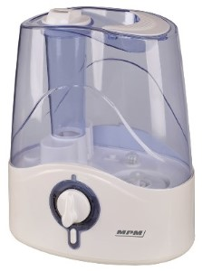
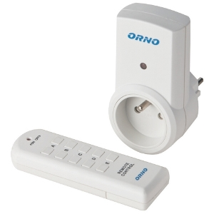
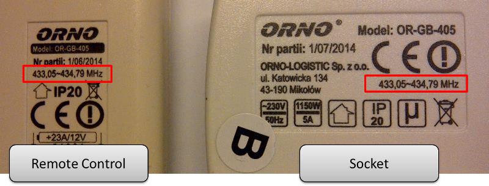
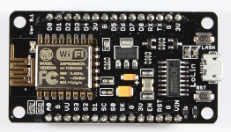
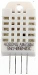
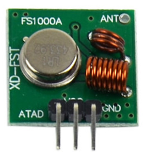
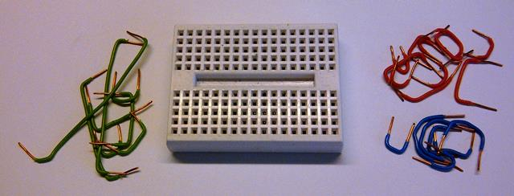
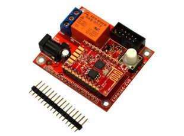
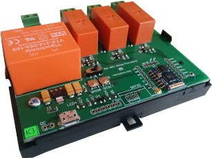

# Components

What kind of hardware and software you need.

## Table of Contents

* [Hardware](#hardware)
  * [Humidifier and RC Socket](#humidifier-and-rc-socket)
  * [Microcontroller and I/O](#microcontroller-and-io)
  * [Miscellaneous](#miscellaneous)
  * [Hardware Bill of Materials](#hardware-bill-of-materials)
  * [Other Hardware Options](#other-hardware-options)
* [Software](#software)
  * [Software Bill of Materials](#software-bill-of-materials)
* [I have all Required Components - What Next?](#i-have-all-required-components---what-next)

## Hardware

### Humidifier and RC Socket

To build this project you need a humidifier. Look for simple one with manual control and big enough water container suitable for the size of your flat. Mine has 4.2 l (0.9 gal) container and is rated for 17 m2 (183 sq. ft) room. Basing on my experience, if you run it at most output, it will easy cover 2 – 3 x larger area of a typical 2.7 m (8.9 ft) high flat.  But if you set it at maximum, you may need to place it on a chair or a table so mist is able to disperse before wetting the floor.

You need to be able to switch humidifier remotely on and off depending on ambient humidity. I decided to use RC socket for this purpose. This is safe, simple and cheap solution. Such sockets are around for several years, easy to buy and control. I recommend one with LED to see instantly if it is on or off. 

|  |   |
| --- | --- |
| Humidifier | RC Socket with Remote |

When searching for the RC socket, look for a model that operates in RF 433 MHz frequency band. Information about that is typically placed on the package, in specification as well as on the socket and remote control - see picture below: 

### Microcontroller and I/O

Automatic control will be done by microcontroller. I have selected NodeMCU 1.0 that has ESP8266 Wi-Fi on board, 4MB flash memory, mini USB port and is really easy to program with Arduino IDE.

Next key component is humidity sensor that we should hook up to our microcontroller.

The last key piece is a radio transmitter to operate RC socket as if using the remote control. Do not be scared. Such transmitter is really easy to hook up and operate by a microcontroller.

|  |  |  |
| --- | --- | --- |
| ESP8266 | Humidity Sensor | RF Transmitter |

### Miscellaneous

You will also need some minor stuff like jumpers or breadboard and I will discuss it once we come to the details. 

### Hardware Bill of Materials

Here are exact models I am using.

*	Humidifier - **MPM, model MNP-01**
*	RC Socket - **ORNO (R), model OR-GB-405**
*	ESP8266 - **LoLin NodeMCU V3 by wemos.cc**
*	Humidity Sensor - **AM2302 by AOSONG**
*	RF Transmitter - **RF 433, model FS100A**

To buy humidifier and RC socket go to your local store with electric household appliances. 

Remaining three components: ESP8266, humidity sensor and radio transmitter you can easy buy on-line. 

### Other Hardware Options

You may consider reduction of number of hardware components by using an ESP8266 relay board like below:

|  |  |
| --- | --- |
| ESP8266-EVB by [Olimex]( https://www.olimex.com) | 3CH Wi-Fi Relay Control Board by [Martin Harizanov](https://harizanov.com/) |

There are the following cons and pros of such solution:

* (+) smaller number of components / RF transmitter and RF socket will not be required
* (+) smaller footprint of solution if ESP8266-EVB relay board is used
* (+) ESP8266-EVB relay board may be possibly hidden inside of humidifier housing / self-enclosed solution - no external components
* (+) external DC power supply not required if 3CH Wi-Fi Relay Control Board is used
* (-) humidity sensor may be too close to humidifier / measurements may be exaggerated when humidifier is on
* (-) need to build external housing for relay board (if not mounted inside humidifier)
* (-) external USB / serial converter is required / less experienced may be discouraged
* (-) solution not recommended for users not experienced with handling of mains power

Another option to consider is using RC socket that has ESP8266 already build in. Such sockets should be soon widely available. Check [this thread]( http://www.esp8266.com/viewtopic.php?p=37583#p37583) on ESP8266 Community Forum for initial information.

## Software

We will build this project using open source software - primarily Arduino IDE and ESP8266 core for Arduino.
Besides that we will also need Arduino libraries for humidity sensor and RF transmitter.

### Software Bill of Materials

Below are the links to the software we need:
* Arduino IDE - https://www.arduino.cc/
* ESP8266 core for Arduino - https://github.com/esp8266/Arduino
* Humidity sensor library - https://github.com/adafruit/DHT-sensor-library
* RF transmitter library - http://randysimons.nl/26-433mhz-libraries-for-arduino

## I have all Required Components - What Next?

Check section [Setup](../3-Setup) to learn how to compile and download your first sketch and make a LED blinking :star2:

