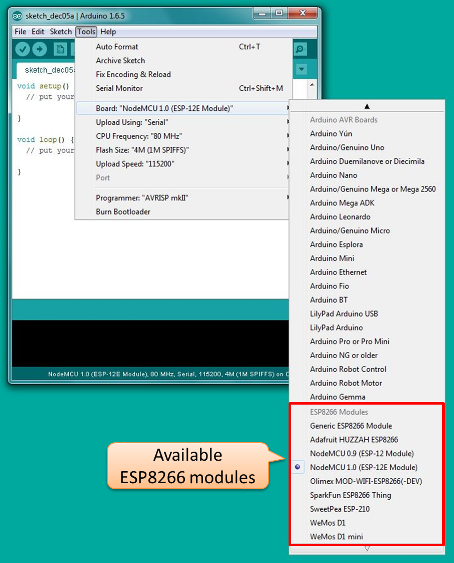
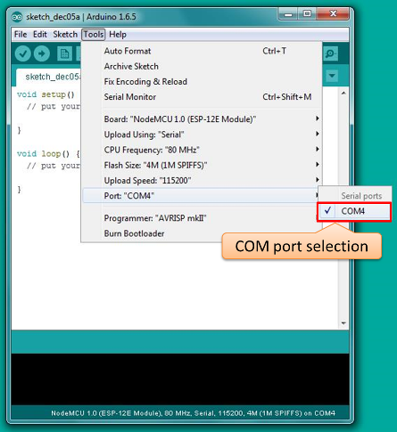
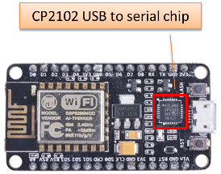
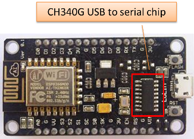
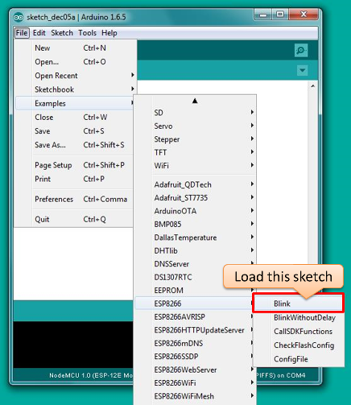
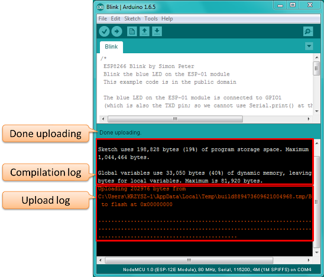
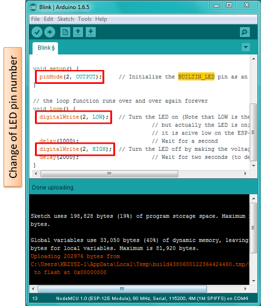

# Setup

Programming of ESP8266 SoC microcontroller with Arduino IDE is really straightforward. See below how to quickly go up to speed :zap:

## Table of Contents

* [What You Need](#what-you-need)
* [Configure IDE](#configure-ide)
* [Hook up Your ESP Module](#hook-up-your-esp-module)
* [Upload Example Sketch](#upload-example-sketch)
* [Tweaking Your Sketch](#tweaking-your-sketch)
* [What Do We Do Next?](#what-do-we-do-next)

## What You Need

To start programming ESP8266 with Arduino IDE you need just three things:

*	PC where we install Arduino IDE
*	ESP8266 board with USB port – see [Components](../2-Components)
*	USB cable

## Configure IDE

To start with, install Arduino IDE and ESP8266 board support. Please go ahead and follow instructions in chapter [Installing with Boards Manager](https://github.com/esp8266/Arduino#installing-with-boards-manager) under https://github.com/esp8266/Arduino. This project is using **version 2.0.0** of ESP8266 platform package.
 
Once installation is successfully completed, in Board menu, we will see several ESP8266 boards that are supported by ESP8266 core for Arduino.

Select board you have. In my case it is NodeMCU 1.0. I like using it for development because it does not require external USB to serial converter and power supply. All you need to connect is micro USB cable and you are ready to go. If you are using another board, please select what you have.

## Hook up Your ESP Module

Now connect ESP to USB port in your PC. After it is recognized by the system you will see it in Ports menu. Select port where your ESP is connected to.

If your board is not recognized you may need to download and install USB driver. For NodeMCU 1.0 board, depending on model you   typically need either [CH340G](http://www.wch.cn/download/CH341SER_EXE.html) or [CP2102](https://www.silabs.com/products/mcu/Pages/USBtoUARTBridgeVCPDrivers.aspx) driver.

|  |  |
| --- | --- |
|  NodeMCU 1.0 with CH340G USB to serial chip | NodeMCU 1.0 with CP2102 USB to serial chip |

## Upload Example Sketch

We should be ready now to upload our first sketch to ESP. Please go to File > Examples > ESP8266 and select Blink.ino. 

Then just press Upload. The sketch will be first compiled and then upload to ESP. Once this is complete you will see that LED on your ESP module is blinking. 

Congratulations! You have just compiled and uploaded your first sketch!

## Tweaking Your Sketch

If LED is not bilking this may be because of incorrect LED pin number coded behind BUILTIN_LED define. Replace all occurrences of BUILTIN_LED with LED pin number appropriate for your board. For NodeMCU LoLin I have, the BUILTIN_LED should be 2. Please see on the screenshot below updates I have made.

If led is blinking, go ahead and change one of both delays. Upload program to see different blinking pattern.

## What Do We Do Next?

If you are comfortable with controlling blink pattern of LED you can go to the next step - hook up humidity sensor and prepare a program to make some measurements. This is discussed in chapter [Measure](../4-Measure) of this tutorial.

