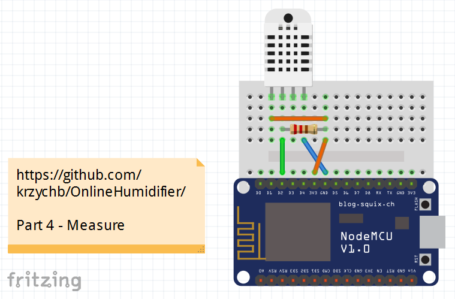
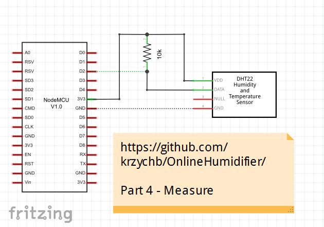
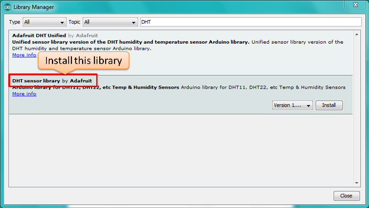
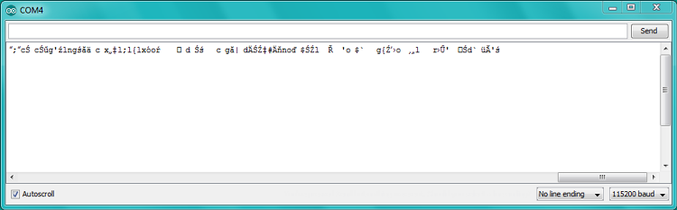
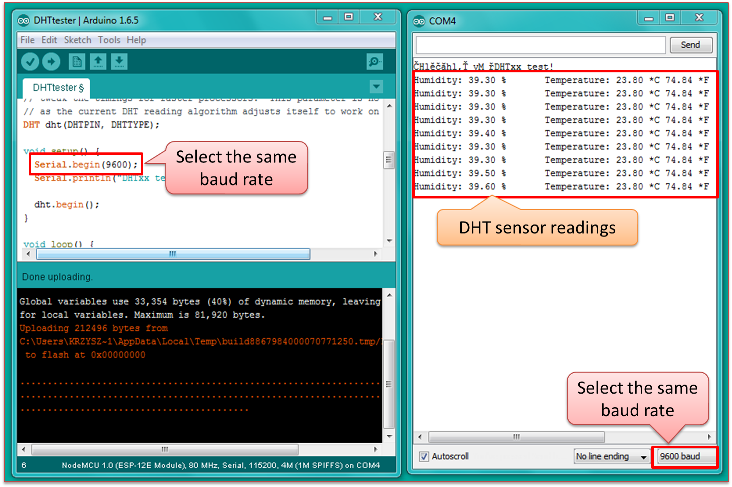
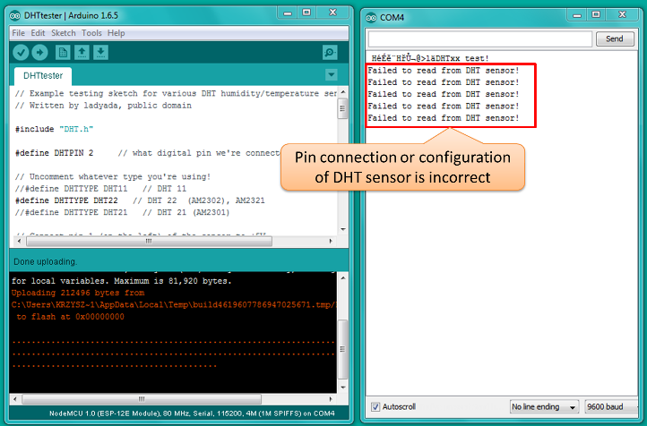
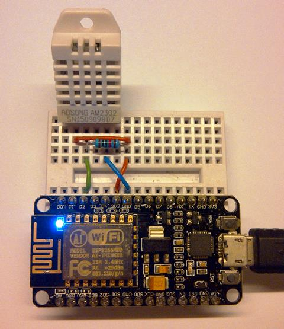

# Measure
In previous section we have [setup Arduino IDE for ESP8266 programming](../3-Setup). Now we are ready to connect humidity sensor to our ESP and make some humidity measurements. 


## What You Need

* PC and ESP8266 board set up in [previous step](../3-Setup).
* DHT22 humidity and temperature  sensor
* 5 to 10 kOhm resistor
* Breadboard
* Some jumpers

For additional details please refer to section [Components](../2-Components)

## Hardware Setup – the Breadboard Time
First please connect DHT22 sensor, resistor and ESP module as shown on [schematics](esp8266-dht22.fzz) below.




As you may notice we are connecting 3.3V and GND taken from ESP to first and forth pin of DHT22 – this will provide power supply for the sensor. Second pin provides humidity measurement. It is connected to input D2 of ESP. It is also connected to a resistor that pulls this pin up to 3.3V. Communication between sensor and ESP is done using a custom serial protocol. If you are interested in details please check DHT22/AM2302 sensor [data sheet](pictures/AM2302.pdf). 


## Software Setup

Once hardware connections are ready let us prepare the software. I have mentioned that ESP is communication with DHT22 sensor over a custom protocol.  This protocol has been already implemented for Arduino in a [DHT sensor library](https://github.com/adafruit/DHT-sensor-library) that we can use instead of writing it by ourselves. To do so we first need to install it. Go to Sketch > Include Library > Manage Libraries… and type “DHT” in search box. Pick “DHT sensor library” and install it. 



Once library is installed, go to File > Examples > DHT sensor library and pick DHTtester.ino sketch. Now in the sketch we need to verify the pin number where DHT22 is connected to. In sketch is entered as ``` #define DHTPIN ``` with value of 4. In my case (check the schematic above) it is D2, so I need to replace 4 with D2. 


You may need to adjust the pin number, if you are using different board. Please note the ``` #define DHTTYPE DHT22 ``` below that specifies DHT22 that is the sensor type we are using.  If you are using different type of DHT then comment line with DHT22 and uncomment another line with your sensor type. 

After ``` DHTPIN ``` and ``` DHTTYPE ``` are set up to match your configuration click upload.

Once upload is complete open Serial Monitor (Ctrl+Shift+M). If you see garbage on the screen over and over then verify baud rate of Serial Monitor. 



In the sketch the baud rate it is setup to 9600 bits per second. Check if the same value is selected on Serial Monitor. If this is done and sensor is correctly connected, you should see humidity and temperature values updated every second.



You will still see some garbage characters just after reset. This is normal behaviour as initially module outputs data on serial at 74880 bits per second. Then it is switched to 9600 rate as instructed by the following command:

```cpp
Serial.begin(9600) 
```

In there are issues with DHT sensor connections or configuration you will see a repetitive error message “Failed to read from DHT sensor!” displayed on the Serial Monitor. 



If this is the case then verify DHT sensor connections and configuration:

* Are all three sensor pins correctly connected?
* Is 3.3V power supply provided to the sensor?
* Is ``` DHTPIN ``` set up correctly?
* Is ``` DHTTYPE ``` set up correctly?

Please see below the hardware setup used for preparation of this tutorial.




## Next Step

Now you know to use ESP8266 to measure humidity. With no effort at all, using the same DHT sesor you can also measure temperature. In section [Show](../5-Show) I will describe how to display current measurements on-line in a web browser. 

