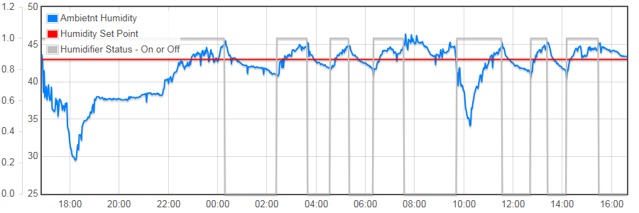
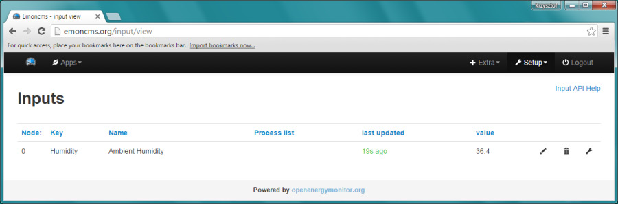
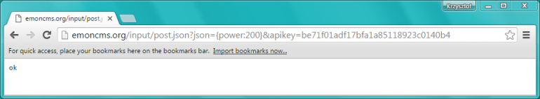
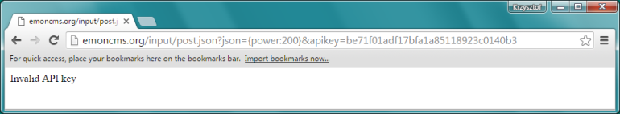
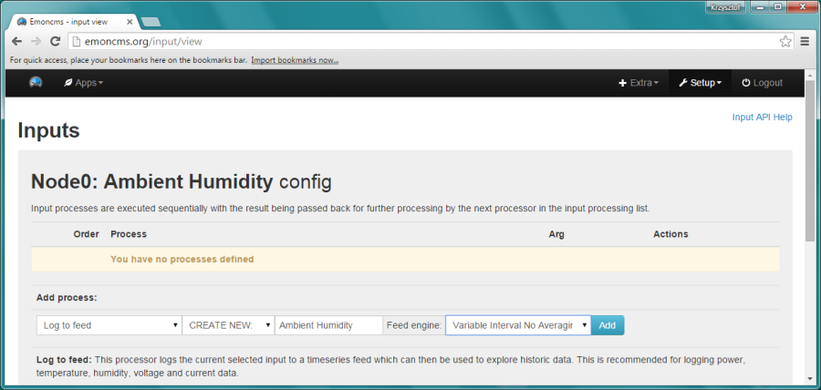
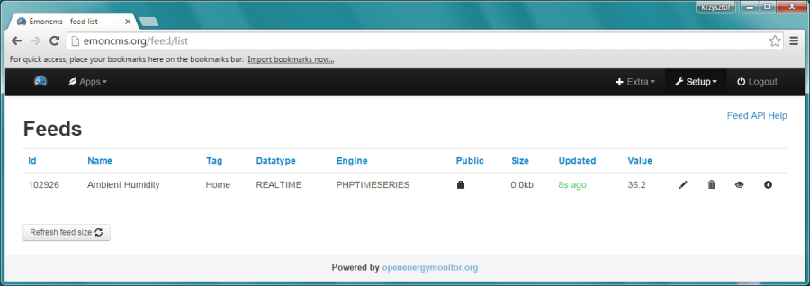
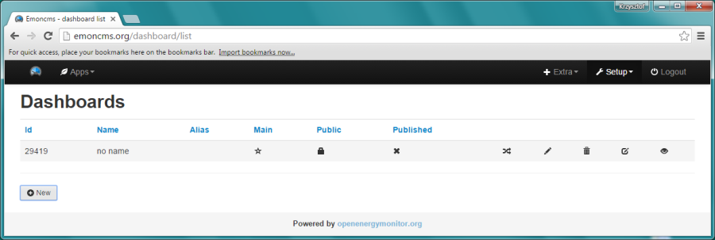
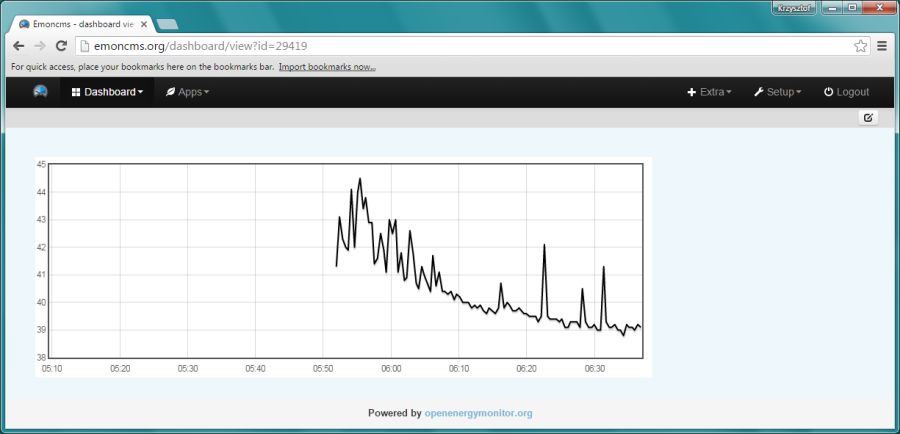

# Chart


## Table of Contents

* [Introduction](#introduction)
* [Emoncms](#emoncms)
* [Setup](#setup)
* [Push](#push)
* [Visualize](#visualize)
* [Save](#save)
* [Chart](#chart)
* [Next Steps](#next-steps)


## Introduction

I think that development of applications for ESP8266 has been made really easy to everybody. This is thanks to [ESP8266 core for Arduino](https://github.com/esp8266/Arduino) developed by [Ivan Grokhotkov](https://twitter.com/i_grr) and [esp8266/Arduino](https://github.com/esp8266/Arduino/graphs/contributors) team. In [previous section](../5-Show) I have shown how easy it is to present measurements online with just couple of simple modifications to existing example sketch.

In this section I would like to make another step - push data to the cloud and present them online on a chart. 




## Emoncms

There are several cloud services that you can use for such purpose. I am pretty familiar with [ThingSpeak](https://thingspeak.com/) and [Emoncms](http://emoncms.org/) and will refer to them.

For this particular project I propose to use [Emoncms](http://emoncms.org/). I found it easier to configure a chart to show multiple values, that you can quickly browse or zoom for the period you want. 

After putting our automatic humidity control into operation we would like to be able to analyse its performance. We will do it by checking relationship between humidity set point, actual humidity value and on/off status of humidifier. It is easier to do it on a single chart rather than on three separate charts. 

On the other hand I can recommend [ThingSpeak](https://thingspeak.com/) if you need flexibility of extra data processing before displaying. ThinkSpeeak provides MATLAB for that and imagine what fancy things you can do with it! After processing you can then display the data using huge [charts or plots](https://www.mathworks.com/products/matlab/plot-gallery.html?refresh=true) gallery.


## Setup

Go ahead, open http://emoncms.org/ and register. All you need to provide is login, e-mail and password. Once registered, you will get free access to storage space for your data as well as dashboards to present them online.

To learn how to send data to Emoncms, login into it, go to *Setup > Inputs* and open [Input API Help](http://emoncms.org/input/api) link. Under chapter *Available JSON commands* you will be able see a link like: ``` http://emoncms.org/input/post.json?json={power:200}&apikey=9a3e3c9cf65c70a597097b065dcb24e3 ```. This is so called [JSON](https://en.wikipedia.org/wiki/JSON) command used to send data to Emoncms cloud. It consists of three parts:

1.	``` http://emoncms.org/input/post.json?json= ``` : an url to server that processes JSON,
2.	``` {power:200} ``` : data to be sent as a name:value pair (you can add more pairs separated by comma),
3.	``` apikey=9a3e3c9cf65c70a597097b065dcb24e3 ``` : unique identifier of your space on Emoncms.

You will find your API keys at the top of API Hep page. To post data use “Read & Write” key.

**Note:** Formal description of JSON is provided in [RFC 7159](https://tools.ietf.org/html/rfc7159) standard. According to this standard, the name (as a string) should begin and end with quotation marks. This is not the case in example above, as `power` is not enclosed in quotation marks. Keep in mind, that even if it works for Emoncms, it may not work elsewhere. 

## Push

Now we need to instruct ESP to periodically measure humidity and open similar JSON link but containing something like ``` {Humidity:43.5} ```, where ``` Humidity ``` is the name of value we are sending and ``` 43.5 ``` is the value itself. 

Let us program the above operations as functions so it is easier to follow what our code is doing. Functions will be called in a loop every 20 seconds, or so that we can quickly see results. We can increase this period once testing is complete – afterwards is not really required to check humidity level in a room every 20 seconds.

```cpp
loop()
{
  measureHumidity();
  sendDataToEmoncms();

   delay(20000);  // wait 20 seconds
}
```

To prepare the function that will measure humidity, open [DHTtester.ino sketch we have discussed before](../4-Measure#software-setup), copy code and modify it, so humidity is measured and stored in a global variable ``` humidity ```. What I did looks like follows:

```cpp
void measureHumidity(void)
{
  humidity = dht.readHumidity();
  if (isnan(humidity))
  {
    Serial.println("Failed to read from DHT sensor!");
    return;
  }
  Serial.print("Humidity: ");
  Serial.println(humidity);
}
```

You will also need a function to send JSON command to Emoncms and it looks like below.

```cpp
void sendDataToEmoncms(void)
{
  if (client.connect(emoncmsServer, 80))
  {
    String getJSON = "";
    getJSON += "GET http://" + (String) emoncmsServer;
    getJSON += "/input/post.json?json={Humidity:" + (String) humidity + "}";
    getJSON += "&apikey=" + apiKeyEmoncms + "\n";
    getJSON += "Connection: close\n\n";
    client.print(getJSON);
    // display response from Emoncms
    while (client.available())
    {
      Serial.write(client.read());
    }
    Serial.println("Data sent to Emoncms");
  }
  else
  {
    Serial.println("Connection to Emoncms failed");
  }
  client.stop();
}
```

This code opens a new client connection to Emoncms server, sends JSON command, shows received response and finally closes the connection. 

To make this code work we need to declare global variable ``` humidity```.

```cpp
float humidity;
```

We should also declare a string ```emoncmsServer``` containing domain name of Emoncms, another string with the API key (enter your own!) and declare ``` client ``` object. 

```cpp
// Domain name of emoncms server - "emoncms.org"
// If unable to connect with domant name, use IP adress instead - "80.243.190.58"
const char* emoncmsServer = "emoncms.org";
// enter your Write & Write API Key below 
String apiKeyEmoncms = "9a3e3c9cf65c70a597097b065dcb24e3";
WiFiClient client;
```

A copy of complete sketch is saved as [OnlineHumidifier-Graph](OnlineHumidifier-Graph/) and consists of three files that contain individual parts of code – initialization, ``` setup() ``` & ``` loop() ```, humidity measurement and sending data to Emoncms. Such code “modularity” will make it easier to follow and understand growing code as we will be adding some more new functionality.


## Visualize

Once you upload and run this sketch, go to [Inputs](http://emoncms.org/input/view) where you should be able to see humidity value periodically send on Emoncms.



In case of issues check on Serial Monitor what messages are shown – especially what is the reply from Emoncms after JSON command is sent. If command is properly formatted and includes a valid API key, the reply will be just ``` ok ```. Otherwise you should see specific error codes. A handy way to you can troubleshoot is to prepare JSON command in text editor, paste it to a web browser and check what reply is returned. 

If JSON string is correctly formatted, then you should see response as below:



In case of errors, for instance if API key is incorrect, you should see specific message:



Before going to the next step you need make this sketch working, so humidity is properly updated under [Inputs](http://emoncms.org/input/view) every 20 seconds, or according to other specific delay defined in the ``` loop()```. [Minimum interval you can post data to Emoncms is 10s](http://emoncms.org/site/usage) so put a brake on your ESP8266 module!


## Save

In next steps we need to instruct Emoncms to save all the values we send. What you see under [Inputs](http://emoncms.org/input/view) is just last received value. Track record of inputs in maintained under [Feeds](http://emoncms.org/feed/list). To add the Humidity input Feeds, click the wrench symbol shown on right.

Then select Feed engine and press *Add* button



Congratulations! Now all humidity values you send are stored on Emoncms.




## Chart

We are almost there! We can now use humidity feed to show in on a chart. Go to [Dashboards](http://emoncms.org/dashboard/list), click *New* and then click edit symbol on newly created dashboard. 



Open *Visualisation* drop down list, select *rawdata*, click and place a rectangle representing the new chart. After that click *Configure* and select recently created feed with humidity values. After saving changes you should be able to see the chart with humidity measurement updated online with values sent from your ESP board.



Go ahead and experiment with various visualizations, widgets, containers and text. For more details how to use them, refer to https://github.com/emoncms/emoncms.


## Next Steps

Once you get comfortable with your new sketch and Emoncms, make some improvements by sending more than just a single name:value pair at a time. For example an instruction like ```{Humidity:43.5, Temperature:22.3}```  will send to Emoncms two variables, first named ``` Humidity ``` with value  of ``` 43.5 ``` and second named ``` Temperature ``` with value of ``` 22.3 ```. Then practice putting both variables on a single chart. To do so use *multigraph* type chart from *Visualizations*.

This concludes my instructions how to send data to Emoncms and show them on a chart. In next section [Control](../7-Control) I will show you how to switch humidifier on and off remotely. With this functionality in place we will be just a step ahead from getting our humidifier automatically controlling humidity! 

Stick with me – this will be fun!

