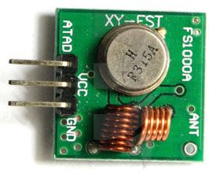
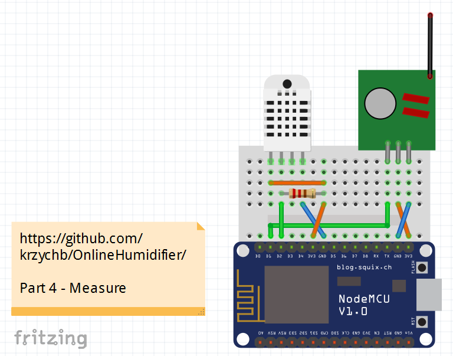
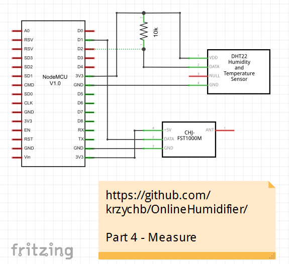
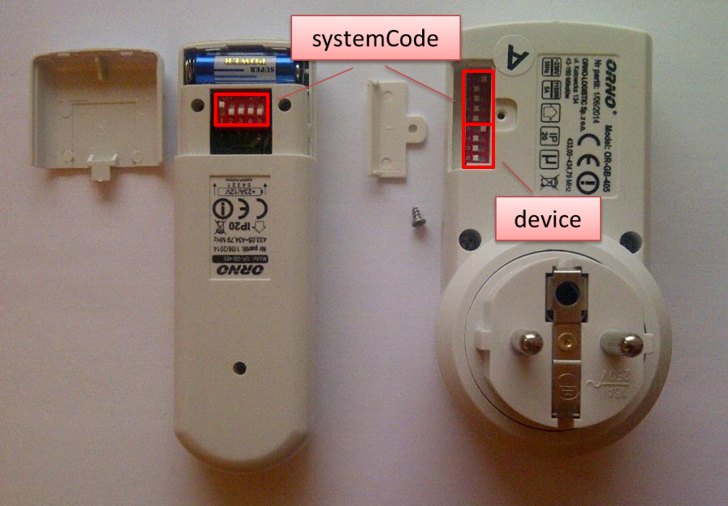
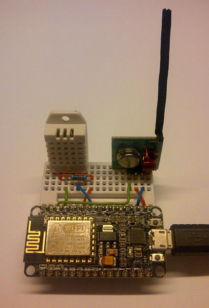
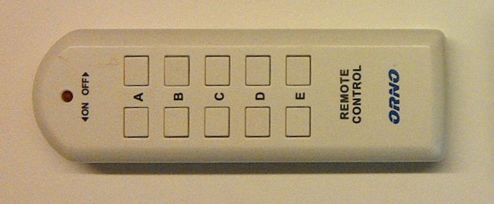
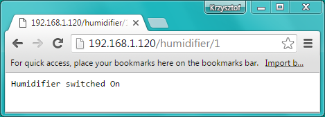
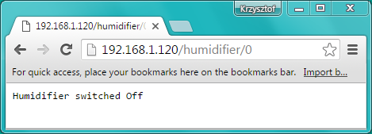
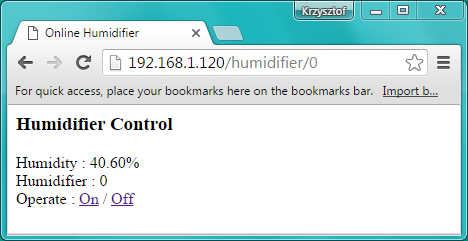

# Control


## Table of Contents

* [Introduction](#introduction)
* [Select RF Socket](#select-rf-socket)
* [Install Library](#install-library)
* [Connect Components](#connect-components)
* [Prepare the Sketch](#prepare-the-sketch)
* [Configure the Transmitter](#configure-the-transmitter)
* [Operate the Socket](#operate-the-socket)
* [Troubleshooting](#troubleshooting)
* [Operate the Socket from Web Browser](#operate-the-socket-from-web-browser)
* [The Next Step - Put it All Together](#the-next-step---put-it-all-together)


## Introduction

In [previous section](../6-Chart) I have presented how to show your measurements online using Emoncms.org that is powerful web application for logging and visualizing data. We need such data for analysis of performance of our humidity control system. We do not have this system operating yet, but we are just there. In this section I would find a demonstrate how to control our humidifier, so we can then remotely switch it on and off depending on current humidity value. 

To do so you will need the following hardware used in section [Measure](../4-Measure/) and in addition:

* RF433 transmitter
* RF433 socket


## Select RF Socket

We should start off by finding proper library to control RF433 socket. There is variety of such sockets on the market as well as variety of Arduino libraries to control them. I propose you to start with nice wiki site with [433MHz libraries for Arduino](https://bitbucket.org/fuzzillogic/433mhzforarduino) by [Randy Simons](http://randysimons.nl/88,over-mij/). It provides couple of libraries for 433 MHz devices including mains sockets. The library I found on this site works perfectly with my ORNO socket. It may or may not work for specific socket you have. Therefore before buying particular socket do research on internet if there is a library available for to control it. You may also decipher protocol used for particular socket and this is a subject by its own. Please see below couple of links to give you an idea what you should be looking for: 

* [Decoding and sending 433MHz RF codes with Arduino and rc-switch](http://www.wes.id.au/2013/07/decoding-and-sending-433mhz-rf-codes-with-arduino-and-rc-switch/)
* [Arduino radio remote control RF 433MHz/315MHz](http://jubitoblog.blogspot.com/2014/06/arduino-radio-remote-control-rf.html)
* [433 MHz system for your Arduino](https://arduinodiy.wordpress.com/2014/08/12/433-mhz-system-for-your-arduino/)
* [433 MHz driver specific thread on ESP8266 Forum](http://www.esp8266.com/viewtopic.php?p=14704#p14704)


## Install Library

Once you have the library you need to install it. Let us do it for library I am using. First I need to download library from https://bitbucket.org/fuzzillogic/433mhzforarduino/wiki/Home. It is provided in section Downloads as a zip file. The all I need to unzip RemoteSwitch library folder and copy it to the folder with other Arduino libraries. You can locate it in Arduino IDE under *File > Preferences > Sketchbook location*. In my case the path to final location is as follows: *C:\Users\Krzysztof\Documents\Arduino\libraries*. For systematic guide how to install libraries please refer to http://www.arduino.cc/en/Guide/Libraries.


## Connect Components

Before switching humidifier control into auto mode let us do some basic testing how RemoteSwitch library works with [RF433 ORNO socket](../2-Components#humidifier-and-rc-socket).

To begin with we need to hook up RF433 transmitter to ESP8266 module. The transmitter has just three pins:

1.	ATAD : transmission modulation
2.	VCC : DC power supply (3 - 12V)
3.	GND : ground



Please see below connection diagram. Transmission modulation is done using D1 digital I/O pin. You may select any other available I/O pin. As for power supply I am using 3.3V available on-board. If you have NodeMCU 1.0 LoLin, you can use 5V instead to provide stronger RF signal and better range. 5V is broken out on this board as *VV* under pin that on other NodeMCU 1.0 boards (like Amica) is marked as *RSV*.




## Prepare the Sketch

Now we need a sketch to operate RF 433 transmitter (modulate RF transmission) in a protocol recognized by RF 433 socket as a command to switch it on or off. This is provided by *RemoteTransmitter* library. See the sketch below. What it does is just toggling the socket on and off every 1 second. 

```cpp
#include <RemoteTransmitter.h>
#define RF433_TR_PIN D1   // pin where RF433 Transmitter is connected to
ActionTransmitter actionTransmitter(RF433_TR_PIN);

void setup()
{
  Serial.begin(115200);
  Serial.println();
  Serial.println("RF433-SocketTester.ino");
}


bool outputRF;

void loop()
{
  // invert (negate) current state of outputRF variable
  outputRF = !outputRF;

  actionTransmitter.sendSignal(1, 'A', outputRF);
  
  delay(1000);
}
```


## Configure the Transmitter

The key command to operate socket is ``` actionTransmitter.sendSignal(1, 'A', outputRF) ``` and it has the following three parameters:

1.	*systemCode* : 5-bit address (dip switches in remote). Range ``` [0..31] ```
2.	*device* :	Device to switch. Range: ``` [A..E] ``` (case sensitive!)
3.	*on* : ``` True ```, to switch on. ``` False ``` to switch off

Selection of *systemCode* and *device* for ORNO socket is done using dip switches. Please see picture below of setting the *systemCode = 1* on remote control and both *systemCode = 1*  as well as *device = A* on the socket.




## Operate the Socket

Go ahead, connect all components, load the sketch and make it working.



Currently I am using RD 433 transmitter without the antenna (the black cable connected to the ANT terminal shown on picture above). This is because I found it operating without any problems though walls on distance of couple of meters and that was more than enough in my case.

You can use sketch [RF433-SocketTester.ino](RF433-SocketTester/RF433-SocketTester.ino) to verify how it performs in your case by moving transmitter away from your socket until the relay in socket stops clicking. Add the antenna of about 17.28 cm / 6.80 inch, if you need to operate it close to the maximum range.  Check [this post](http://blog.solidremote.com/post/rf-module-external-antenna-design.aspx) for antenna recommendations.


## Troubleshooting

In case of issues use remote control for troubleshooting. It is normally provided together with sockets.



Verify that the *systemCode* on remote is set up exactly the same as on the socket. Then use the On / Off buttons that correspond with one of *devices* A through E that has been selected using DIP switch on your socket. If your remote control have different method of pairing with socket then you may need to search for a different library. 

There are plenty of models of RF433 sockets on the market. You may not be lucky finding a ready library to operate your RF433 socket. If this is the case, resort to sniffing the protocol used by remote to decipher command for putting the socket on and off. This a subject by its own. To have an idea what is required and how to approach this task, check [this article](https://arduinodiy.wordpress.com/2014/08/12/433-mhz-system-for-your-arduino/).

In any case make sure that your socket is operational from the sketch before going to the next step.


## Operate the Socket from Web Browser

It is time to start joining the dots and putting together some pieces of software and hardware we have developed so far. Let us combine the code to operate socket we have just tested with [code developed previously for a web browser](link). This is to prepare a sketch to switch the socket on and off from the browser.

To start with open previously used sketch [OnlineHumidifier-Show](link) and save it as *OnlineHumidifier-Control*.  The idea is to update this sketch with two links, that when clicked, will be processed by ESP and turn on or off the humidifier connected to the RF422 socket.

I propose the following simple format of links (let us assume that ``` 192.168.1.120 ``` is IP of your ESP):

* ``` http://192.168.1.120/humidifier/1 ``` - to turn humidifier on
* ``` http://192.168.1.120/humidifier/0 ``` - to turn it off

Now we need to write a procedure that will recognize request for ``` /humidifier/1 ```, and issue the command to switch the socket on (or off for ``` /humidifier/0 ```). It turns out that there is already some code in the sketch you have just saved, that can be used for this purpose. Go to ``` setup() ``` and Look for the following code:

```cpp
server.on("/inline", [](){
  server.send(200, "text/plain", "this works as well");
});
```

Now load this sketch, enter IP address of ESP shown in Serial Monitor and add ``` /inline ``` at the end (if IP of you ESP is ``` 192.168.1.120 ```, then the whole url will look like ``` http://192.168.1.120/inline ```). Once entered you should see the following output.


Basing on this example we should be able to add similar code that will run if the link is in format that we need, i.e. ``` http://192.168.1.120/humidifier/1 ``` (or ``` /0 ```). Let us do it:

```cpp
server.on("/humidifier/1", [](){
  actionTransmitter.sendSignal(1, 'A', True);
  server.send(200, "text/plain", "Humidifier switched On");
});

server.on("/humidifier/0", [](){
  actionTransmitter.sendSignal(1, 'A', False);
  server.send(200, "text/plain", "Humidifier switched Off");
});
```
After opening updated code in web browser, the following will be displayed:




This is fantastic! We can control humidifier from web browser :+1:

Using the code we have just tested together with [OnlineHumidifier-Show](../5-Show/OnlineHumidifier-Show/) and [OnlineHumidifier-Chart](../6-Chart/OnlineHumidifier-Chart/) sketches developed previously, we are now in position to provide a link for switching humidifier on and off as well as displaying ambient humidity on a single web page. This time, instead of providing a page in a plan text, we will use HTML for easier formatting. For convenience I will prepare a separate procedure to do that:

```cpp
void showControlScreen(void){
  String message;
  message += "<html>";
  message += "<head><meta http-equiv='refresh' content='5'/><title>Online Humidifier</title></head>";
  message += "<body>";
  message += "<h3>Humidifier Control</h3>";
  message += "<p>";
  message += "Humidity : " + (String) humidity + "%<br />";
  message += "Humidifier : " + (String) humidifier + "<br />";
  message += "Operate : ";
  message += "<a href=\"/humidifier/1\">On</a>";
  message += " / ";
  message += "<a href=\"/humidifier/0\">Off</a>";
  message += "</body>";
  message += "</html>";

  server.send(200, "text/html", message);
}
```

This procedure is using global variables that contain ambient humidity and humidifier status. The statement ``` 'refresh' content='5' ``` will cause the page to reload itself every 5 seconds, so we can see humidity value changes. 

The  HTML code to render a link looks as follows ``` <a href="/humidifier/1">On</a> ```. Corresponding statement in Arduino code should contain additional escape character ``` \ ``` before each quotation mark like this -``` \" ```. This is to distinguish it from quotation mark that means beginning or end of a string.

Complete sketch is saved as [OnlineHumidifier-Control](OnlineHumidifier-Control/). If you compile it, upload and open ``` http://192.168.1.120/humidifier/0 ``` (do not forget to replace ``` 192.168.1.120 ``` with IP of your ESP!) the following will be displayed in web browser:



I encourage you to improve this sketch by changing the font, adding graphics, alter colors of displayed information basing on humidifier status or humidity range, show % of the time when humidifier was on, etc.


## The Next Step - Put it All Together

Now we have all key pieces of the code to control our humidifier remotely and see how it influences ambient humidity. In next section [Automate](../8-Automate) I would like to show how to make it work autonomously and adjust ambient humidity to a set point we define.  Do not miss to check it and implement to work for you!
