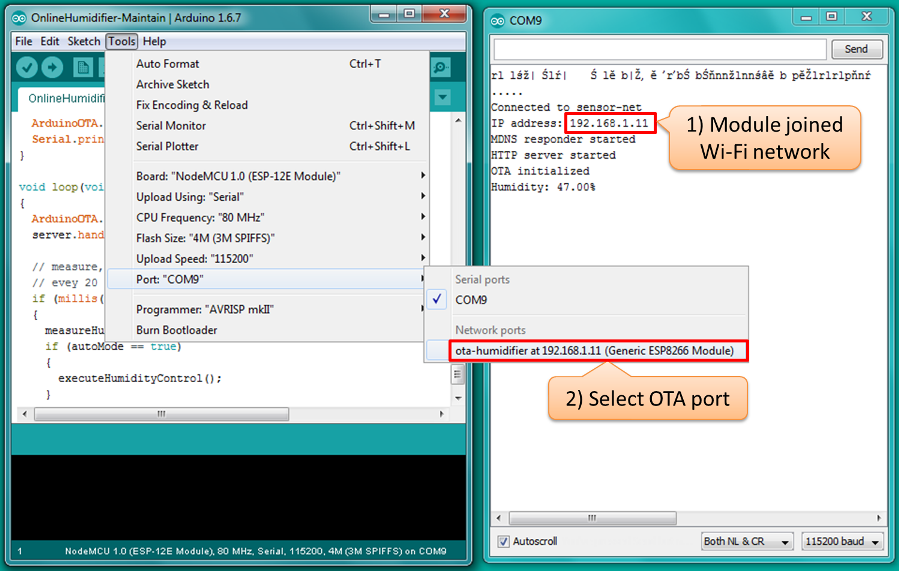
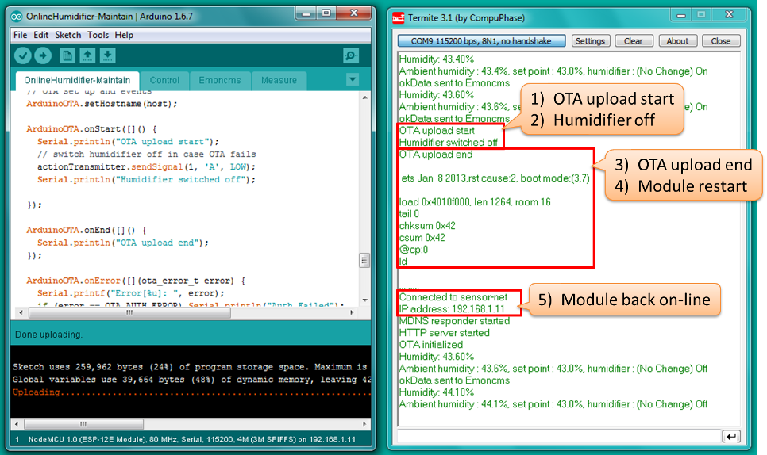
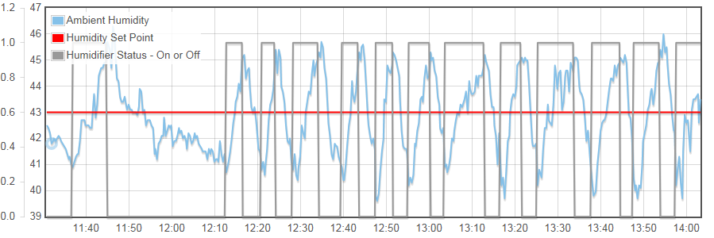
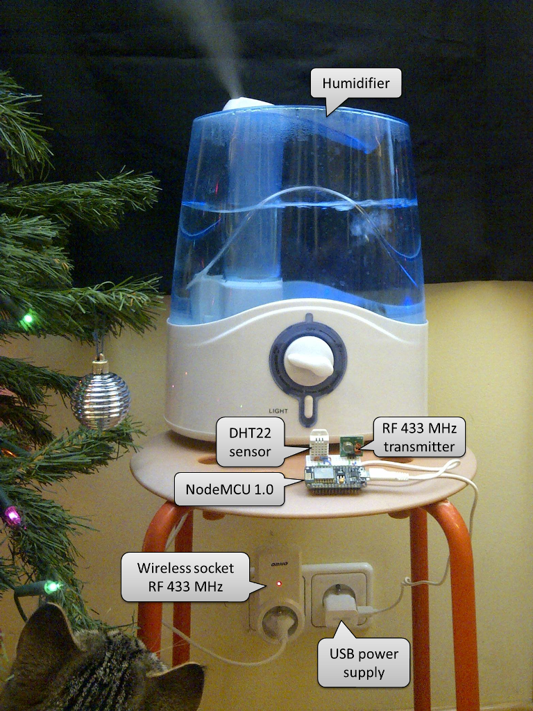

# Maintain

In [previous section](../8-Automate) we have completed our goal of implementation of automatic humidity control. Now I would like to discuss supplementary topic of making the changes to the sketch in more convenient way. For sure you have several ides how to improve this project by providing better automatic control strategy, more friendly and feature rich user interface or maybe adding additional sensors to monitor conditions in your house.

If you have been working with Arduino UNO board before, you may noticed that compilation and then uploading a sketch to ESP8266 takes a lot of time. This is due to size of compiled sketch that is likely 10x bigger comparing to Arduino UNO. To upload [OnlinHumidifier-Automate.ino](../8-Automate/OnlineHumidifier-Automate) sketch using a serial port takes about 30 seconds. Fortunately we can improve this time if we upload module using Wi-Fi connection rather than a serial port. Such method of module upload is called OTA (Over the Air) and has some additional benefits. You can get rid of USB/serial cable and can perform the update remotely - there is no limitation how far the module is located assuming that it is reachable over Wi-Fi connection.

There are three basic options to perform OTA uploads and they are discussed in in details in [documentation](https://github.com/esp8266/Arduino/blob/master/doc/ota_updates/ota_updates.md#introduction) of [esp8266/Arduino] (https://github.com/esp8266/Arduino) repository. Out of these options I would like to implement uploads directly from [Arduino IDE] (https://github.com/esp8266/Arduino/blob/master/doc/ota_updates/ota_updates.md#arduino-ide).


## Table of Contents

* [Preparation](#preparation)
* [Update the Sketch](#update-the-sketch)
* [Make First Upload](#make-First-upload)
* [Make Next Uploads Faster](#make-next-uploads-faster)
* [Conclusion](#conclusion)


## Preparation

To start with please check documentation what are the [basic requirements](https://github.com/esp8266/Arduino/blob/master/doc/ota_updates/ota_updates.md#basic-requirements) for performing OTA. If the module you are using meets these requirements then go to the next step. 

To perform OTA using Arduino IDE you need Arduino IDE 1.6.7 and 2.0.0 version of ESP8266 platform package. Please update your software if you have earlier versions following instructions in chapter [Installing with Boards Manager](https://github.com/esp8266/Arduino#installing-with-boards-manager) under https://github.com/esp8266/Arduino.

Now go to [esp8266/Arduino] (https://github.com/esp8266/Arduino) repository, open [documentation](https://github.com/esp8266/Arduino/blob/master/doc/ota_updates/ota_updates.md#arduinoota) and follow detailed step by step instructions to practice OTA updates. During this practice you will use *BasicOTA.ino* sketch available in Arduino IDE under *File > Examples > ArduinoOTA*.

Finally open your sketch [OnlinHumidifier-Automate.ino](../8-Automate/OnlineHumidifier-Automate) and save it as *OnlinHumidifier-Maintain.ino*. Then open *BasicOTA.ino* sketch as well. We will use it as an example of OTA implementation and copy from it the OTA code to our new *OnlinHumidifier-Maintain.ino* sketch.


## Update the Sketch

After reading documentation and following example with *BasicOTA.ino* you should have basic idea how OTA works. More details are provided below.

First copy to you sketch two header file  includes required for ArduinoOTA implementation. In original *BasicOTA.ino* file there are more includes, but we have some of them in our sketch already.

```cpp
#include <WiFiUdp.h>
#include <ArduinoOTA.h>
```

Then define actions to be performed on start and end of OTA update as well as on particular errors. This should be done in ``` setup() ```, as in original example:

```cpp
  ArduinoOTA.onStart([]() {
    Serial.println("OTA upload start");
    // switch humidifier off in case OTA fails
    actionTransmitter.sendSignal(1, 'A', LOW);
    Serial.println("Humidifier switched off");
  });
  
  ArduinoOTA.onEnd([]() {
    Serial.println("OTA upload end");
  });
  
  ArduinoOTA.onError([](ota_error_t error) {
    Serial.printf("Error[%u]: ", error);
    if (error == OTA_AUTH_ERROR) Serial.println("Auth Failed");
    else if (error == OTA_BEGIN_ERROR) Serial.println("Begin Failed");
    else if (error == OTA_CONNECT_ERROR) Serial.println("Connect Failed");
    else if (error == OTA_RECEIVE_ERROR) Serial.println("Receive Failed");
    else if (error == OTA_END_ERROR) Serial.println("End Failed");
  });
```
Note that on OTA start ``` ArduinoOTA.onStart([]() ``` we are switching the humidifier off ``` actionTransmitter.sendSignal(1, 'A', LOW) ```. Imagine what may happen if humidifier is on during OTA and the OTA process fails. Humidifier will keep going until we fix the code or switch it off manually. This normally should not be a problem unless OTA update is done from remote location and we have no physical access to switch it off. Therefore it is a good practice to bring the equipment controlled by module to safe state before attempting to flash a new code.

If you are planning to set up a network of several ESP modules, consider giving each of them an easy to recognize name. This name will be then visible in Arduino IDE, so you have easier time selecting particular module for upload. To do so use ``` ArduinoOTA.setHostname(TheHostNmae) ``` and place this code in ``` setup() ``` as well:

```cpp
  ArduinoOTA.setHostname("OTA-Humidifier");
```

As the final preparation step announce that module is available to OTA. This will start mDNS service using provided above hostname.

```cpp
  ArduinoOTA.begin();
```

Now all you need to do is to instuct module at which condition to accept OTA packets. This is done using ``` ArduinoOTA.handle() ``` function call. To have better conrol when update is done, in you final application consider allowing OTA only on certain condition, e.g. when "OTA Update" button is pressed. In this particular case our goal is to speed up module uploads. Therefore we would like the module to be available for OTA anytime it joins Wi-Fi network. To do so we will simply place this function call in a ``` loop() ```:

```cpp
loop()
{
  ArduinoOTA.handle();

 (...)
 
}
```
Note that in original sketch [OnlinHumidifier-Automate.ino](../8-Automate/OnlineHumidifier-Automate) the code in ``` loop() ``` runs continuously not being blocked by functions like  ``` delay(10000) ```. This way the module is ready to proceed with update immediately after OTA process is started from Arduino IDE. 


## Make First Upload

Before being able to update sketch using OTA you need to upload module for the first time using traditional serial port. Therefore upload module as you were doing it before without changing any upload settings.

Do not worry if during compilation you will see errors like below:


```
(...)In function 'void loop()':

OnlineHumidifier-Maintain:201: error: 'measureHumidity' was not declared in this scope
     measureHumidity();
                     ^
OnlineHumidifier-Maintain:204: error: 'executeHumidityControl' was not declared in this scope
       executeHumidityControl();
                              ^
OnlineHumidifier-Maintain:206: error: 'sendDataToEmoncms' was not declared in this scope
     sendDataToEmoncms();
                       ^
exit status 1
'measureHumidity' was not declared in this scope
```

This is due to issue [#1066](https://github.com/esp8266/Arduino/issues/1066). You need to add all missing function prototypes if particular function is not declared before it is called for the first time. In our case, according to error log above, thre are three functions like that:

```cpp
void measureHumidity(void);
void executeHumidityControl(void);
void sendDataToEmoncms(void);
```

Add them in declaraction section in file *OnlinHumidifier-Maintain.ino*. For complete code, including missing prototypes as well as OTA routines, please refer to [OnlinHumidifier-Maintain.ino](OnlineHumidifier-Maintain).

Now upload updated sketch (Ctrl+U), check how long it takes, and get ready to do upload faster with OTA!


## Make Next Uploads Faster

For you next uploads, all you need to do is to select OTA port, that should show up as below. 



Select OTA port, click upload button (Ctrl+U) and measure upload time again. For me it took 10 seconds. Congratulations! You have improved upload period three times (300%) :smile:

Please see below how OTA process looks like on [external serial terminal](https://github.com/esp8266/Arduino/blob/master/doc/ota_updates/ota_updates.md#troubleshooting). 




## Conclusion

This concludes the last section of project [how to automatically control humidity in your home](https://github.com/krzychb/OnlineHumidifier). I hope you like it :smile: 



If you find any issues with code or descriptions, please report them using *Issues* tab above. If you have any suggestions, post them in [this thread](http://www.esp8266.com/viewtopic.php?p=37446#p37446) of [ESP8266 Community Forum](http://www.esp8266.com/). 

There are many ways you can improve this project to better suit you needs. Explore some of them in [next section](../A1-MQTT).


Krzysztof



P.S. Actually the humidity sensor should be placed away from humidifier. Otherwise desired humidity level may be maintained only in the local area nearby. I put everything close together to show all required components on one picture.

