# MQTT

## Table of Contents
  * [Introduction](#introduction)
  * [Required Components](#required-components)
  * [Why MQTT?](#why-mqtt)
  * [Let us do MQTT!](#let-us-do-mqtt)
  * [Send MQTT Message Manually](#send-mqtt-message-manually)
  * [Send Messages from ESP8266](#send-messages-from-esp8266)
  * [Online Humidifier Talks MQTT](#online-humidifier-talks-mqtt)
  * [Make the Topics Meaningful](#make-the-topics-meaningful)
  * [Next Step](#next-step)


## Introduction

The user interface of our [humidity control system](../8-Automate#auto-mode-on) looks somehow crappy. It ended up [this way](../8-Automate#auto-mode-on) in my attempt to keep this guide simple. Once we learned how make this project running using ESP8266, let us make next step and implement some improvements. What we would like to address is functionality of user interface as well as its look and feel.

Currently, to open humidifier UI in web browser, you need to enter IP address your ESP module. The IP may change after next power up. This means you may need to check it on serial monitor to know what to enter. Instead, we should provide easy to remember url that does not change over time. Humidity set point is hard coded. Each time you decide to change the set point, you need to open the sketch in IDE, update it, compile and upload. The interface screen itself is rather crusty and looks like developed 20 years ago :smile:. All these issues may be easy resolved with some effort learning of HTML, coding new web pages and processing these pages by ESP.

But why not to use already tested, well adopted, versatile and mature functionality of an existing open source home automation systems? One of such systems is [openHAB]( http://www.openhab.org/), I am using it myself and would like to present how we can integrate it with ESP8266 module to run process automation application.

Our goal is to convert existing UI screen to user friendly and nicely looking screen like below to run on a Linux or Windows PC as well as on your favourite mobile device.

| 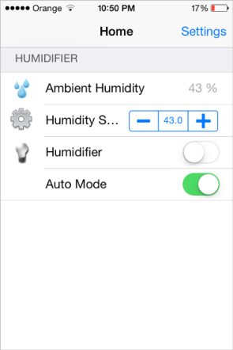 | 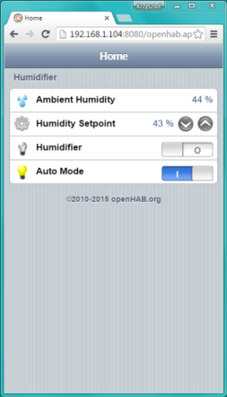 | 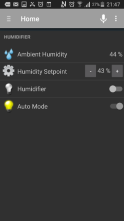 |
| --- | --- | --- |
| Mac iOS - iPhone | Windows - Google Chrome | Android Samsung Galaxy |

In this section we will lay ground work for interacting with openHAB using [MQTT]( https://en.wikipedia.org/wiki/MQTT) protocol. Configuration and using of openHAB will be subject of next section.


## Required Components

* Online Humidifier h/w and s/w developed in section [Maintain](../9-Maintain)
* [MQTT broker](http://www.hivemq.com/blog/mqtt-essentials-part-3-client-broker-connection-establishment) - do not panic, you can use easy to access public broker before setting up one in your home network. You do not even need to register!


## Why MQTT?

If you are interested in IOT or Home Automation you have likely heard about [MQTT]( https://en.wikipedia.org/wiki/MQTT). This is lightweight protocol well suited to send small chunks of data to communicate between IOT devices. If you compare typical information chunk passed over HTTP to display a typical web blog entry, then MQTT message looks like a post on the Twitter.

To pass messages over MQTT you need a MQTT broker. The broker is a piece of s/w that relays messages from devices that publish MQTT messages to devices that would like to listen to these messages.  A device that would like to listen should subscribe to certain message feed in MQTT broker. You can compare MQTT broker to your home router where you connect your computers and mobile devices to.

The best place to install MQTT broker as a computer on your network that is constantly on, like a home [NAS](http://thewirecutter.com/reviews/best-network-attached-storage/). You may also well install it on a Raspberry PI, BeagleBone, Odroid or another similar small computer that does not consume much energy when on. Before you decide where to install MQTT broker, we can use a [public broker](https://github.com/mqtt/mqtt.github.io/wiki/public_brokers) for time being.


## Let us do MQTT!

Before you rush compiling your sketch I recommend uploading another handy piece of software that is called [mqtt-spy](http://kamilfb.github.io/mqtt-spy/). It will make your start into MQTT word much easier by providing an insight how MQTT message looks like and by helping debugging MQTT communication if required. 

Detailed instructions on installation of mqtt-spy on in [wiki]( https://github.com/kamilfb/mqtt-spy/wiki/GettingStarted) of [mqtt-spy GutHub repository](https://github.com/kamilfb/mqtt-spy). Essentially what you need to do is to install Java suitable for your computer, download and unpack mqtt-spy and run a single file that is inside. The file is in format *mqtt-spy-N.N.N-jar-with-dependencies.jar*, where N.N.N is the latest version number. Once done you will see the following window:

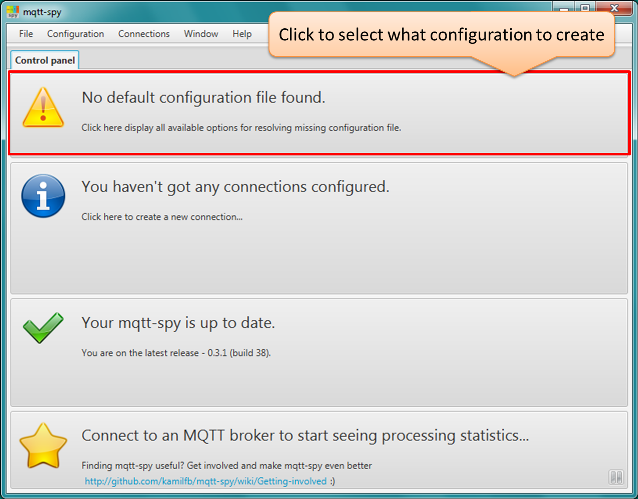

Click on *No default configuration file found* banner and then on *Create mqtt-spy configuration file with sample content*. As result another window will pop up:

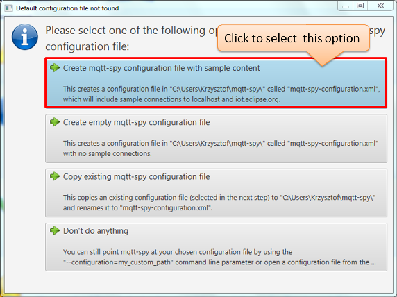

This will make mqtt-spy creating sample connections to public brokers for you:

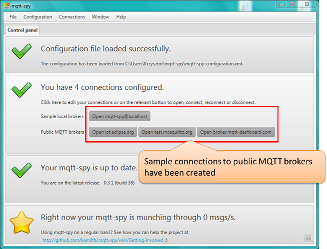

Click *Open test.mosquitto.org*. This is one of available public brokers I have selected for this test. You should see a new tab *test.mosquitto.org* created. Click on that tab. Under *Subscriptions and received messages* you will see */test/#* that is subscription to all messages that have text */test/* at the beginning of its [topic](http://www.hivemq.com/blog/mqtt-essentials-part-5-mqtt-topics-best-practices). Under *Received messages summary* you will see some sample messages:


## Send MQTT Message Manually

Go ahead and publish your message. Enter a topic like */test/manual*, under *Data* type a message *Hello, this is my first MQTT message!* and click *Publish* button. You should immediately see your message bouncing back at the end of *Received messages summary* list.

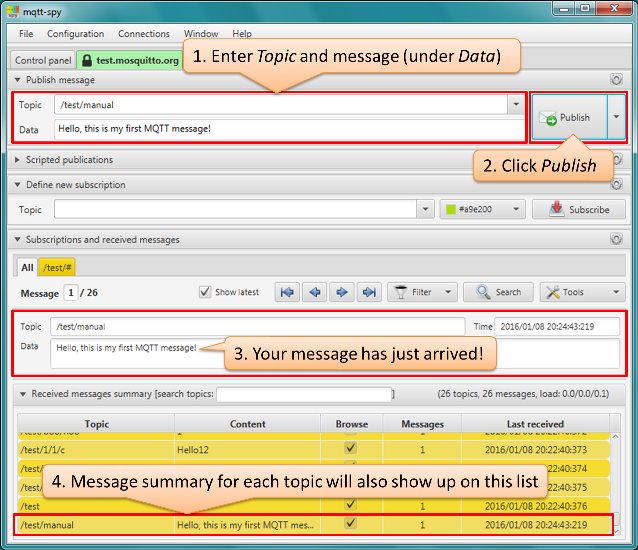

Congratulations - you have published and received your first MQTT message!

Run-through sending messages to another topic and subscribe (under *Define new subscription*) to this specific topic rather than several topics like */test/#*. Note - the *#* sign is like *** in the filename.

## Send Messages from ESP8266
Now once we have practiced and understood (sort of :wink:) how MQTT works, let us publish messages right from ESP8266. 

To start with we need MQTT client library that will do all complicated stuff for us, so we can focus on our project publishing and subscribing to topics that we will then interface with openHAB.

Let us check [Libraries](https://github.com/esp8266/Arduino/blob/master/doc/libraries.md) in [documentation](https://github.com/esp8266/Arduino#documentation) of esp/Arduino GitHub repository. Luckily, under [Other libraries]( https://github.com/esp8266/Arduino/blob/master/doc/libraries.md#other-libraries-not-included-with-the-ide), we will find  *[PubSubClient](https://github.com/Imroy/pubsubclient) - MQTT library by @Imroy*. Please upload and install this library in Arduino IDE. Information how to do it has been provided [here](../7-Control#install-library). Once installed, please go in Arduino IDE to *File > Examples > PubSubClient* and open *mqtt_basic.ino* sketch.

If you have been following previous sections of [Online Humidifier](../readme.md#step-by-step-tutorial) project, you will find out that most of this sketch contains familiar code to connect to Wi-Fi network. Update then SSID and password to your network.

Now let us configure MQTT. We should start with definition of MQTT client object. In original sketch it looks as below:

```cpp
PubSubClient client(wclient, server);
```

Assuming that we will be using *test.mosquitto.org* broker, we need to update ``` PubSubClient ``` client as below:

```cpp
PubSubClient client(wclient, "test.mosquitto.org");
```

Now we need to update topic we would like to publish our message to. The  code in original sketch that is doing it looks as follows:

```cpp
	client.publish("outTopic","hello world");
```

Let us publish our message to a topic */test/esp8266*. To do so we need to update this line as follows:

```cpp
	client.publish("/test/esp8266","hello world");
```

And that's all we need to do.

Please compile and upload your sketch. Open a serial terminal and check if module has connected to your Wi-Fi. Now there is a moment of truth. If your mqtt-spy was closed then open it and then press reset to restart your ESP8266. You should see the following:

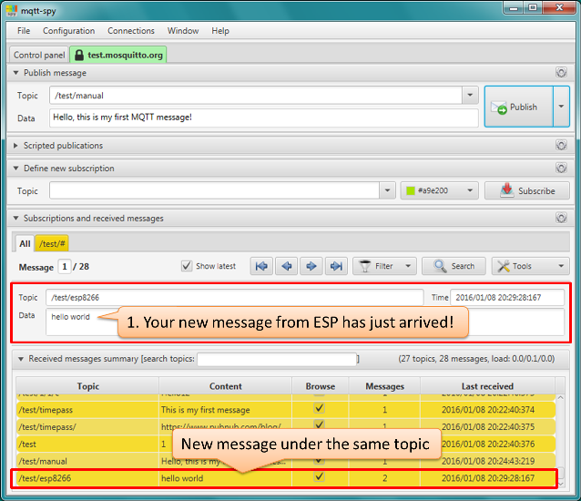

If you like to see more messages, then reset ESP module again because example sketch is sending the message only once.

After successful completion of this step you are ready to publish MQTT messages to anybody. To retrieve your message the other party should connect to the same MQTT broker and need to know the subject to subscribe to. 

Armed with new know-how, let us make our humidifier talking MQTT!


## Online Humidifier Talks MQTT 

Start off by opening your latest [OnlineHumidifier-Maintain.ino]( ../9-Maintain/OnlineHumidifier-Maintain) sketch and saving is as *OnlineHumidifier-MQTT.ino*. The main file *OnlineHumidifier-MQTT.ino* is packed with code. Now we are about to add even more code. To make the code easer to follow, in the same directory, create a new file *Webserver.ino* and move here all web server functions. Do not forget about adding prototypes of moved function at the beginning of main file *OnlineHumidifier-MQTT.ino* as discussed [here](../9-Maintain#make-first-upload).  

I have moved the following functions to the new *Webserver.ino* file:

```cpp
void setupWiFi(void);
void handleRoot(void);
void handleNotFound(void);
void showControlScreen(void);
void setupWebserver(void);
```

Check if your updated sketch compiles without any errors and if it works exactly the same as the original sketch *OnlineHumidifier-Maintain.ino*. Once this is done you are ready to add MQTT routines.

Open example sketch *mqtt_basic.ino* and start with copying MQTT file #includes and ``` PubSubClient ``` object declaration. Please note name changes to match ``` WiFiClient ``` in our original sketch, i.e. *client* has been changed to *MQTTclient*: 

```cpp
#include <PubSubClient.h>
WiFiClient wclient;
PubSubClient MQTTclient(wclient, "test.mosquitto.org");
```

As the second and last modification copy the code responsible for publishing the message, i.e.:


```cpp
    if (!client.connected()) {
      if (client.connect("arduinoClient")) {
        client.publish("/test/esp8266", "hello world");
        client.subscribe("inTopic");
      }
    }
```

There are couple of updates we need to make to it. As before, please change *client* to *MQTTclient*.  Then alter conditions to publish the message so it is published always if connection is present. In original code the message was published only once after establishing connection to broker. Also enter the name of topic to publish the humidity value to. I propose to make it */test/humidity*. Finally replace *hello world* with humidity value.  As result the code would look as follows:

```cpp
    if (!MQTTclient.connected())
    {
      MQTTclient.connect("arduinoClient");
    }
    if (MQTTclient.connected())
    {
      MQTTclient.publish("/test/humidity", (String) humidity);
    }
    else
    {
      Serial.println("connection failed!");
    } 
```

Then place this code inside the *loop()* to execute every 20 seconds after humidity measurement is made and data are sent to Emoncms.org:

```cpp
  if (millis() % 20000 == 0)
  {
    measureHumidity();
    if (autoMode == true)
    {
      executeHumidityControl();
    }

    sendDataToEmoncms();

    if (!MQTTclient.connected())
    {
      MQTTclient.connect("arduinoClient");
    }
    if (MQTTclient.connected())
    {
      MQTTclient.publish("/test/humidity", (String) humidity);
    }
    else
    {
      Serial.println("connection failed!");
    }
  }
```

Believe or not but this is everything you need to publish humidity value using MQTT protocol. Compile and upload your sketch. Open mqtt-spy and shorty you should see topic */test/humidity* popping up every 20 seconds with current humidity value. Isn't it fantastic?

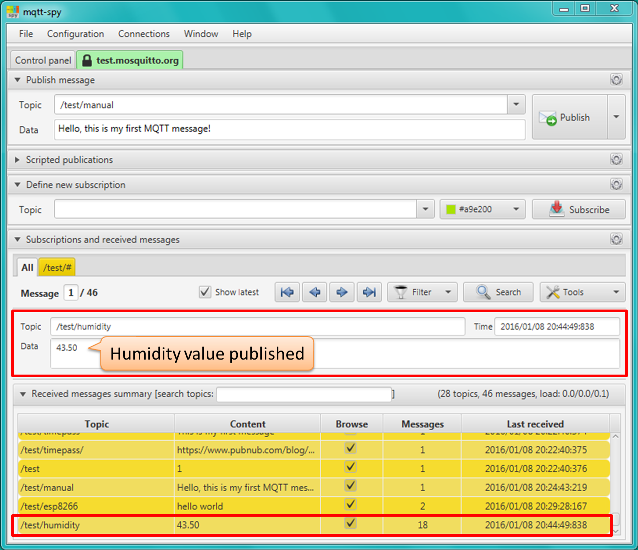


## Make the Topics Meaningful

Once the code is publishing humidity value to a test topic, let us publish also other values that describe status of humidity control.  In particular we would like to publish the following information:

* Humidity set point value
* Operation status of humidifier - on or off
* Mode of hygrostat control - manual or auto

With humidity it will be altogether four values to publish. In order not to confuse what we send, let us select proper topic name for each value. Seeing on mqtt-spy several topics published by other people with *test* at the beginning, we definitely should select more meaningful names. I propose as follows:

| Parameter Description | Sketch Variable Name | MQTT Topic |
| --- | --- | --- |
| Ambient humidity | humidity | krzychb/home/sensor/Humidity |
| Humidity set point | humiditySetPoint | krzychb/home/hygrostat/HumiditySetPoint |
| Operation status of humidifier | humidifier | krzychb/home/hygrostat/Humidifier |
| Mode of hygrostat control | autoMode | krzychb/home/hygrostat/AutoMode |

Once topics are defined let us update the sketch.

 Instead of:

```cpp
MQTTclient.publish("/test/humidity", (String) humidity);

```
You can copy and paste the following code:

```cpp
MQTTclient.publish("krzychb/home/sensor/Humidity", (String) humidity);
MQTTclient.publish("krzychb/home/hygrostat/HumiditySetPoint", (String) humiditySetPoint);
MQTTclient.publish("krzychb/home/hygrostat/Humidifier", (humidifier == HIGH) ? "ON" : "OFF");
MQTTclient.publish("krzychb/home/hygrostat/AutoMode", (autoMode == true) ? "ON" : "OFF");
```

In each topic change *krzychb* to your nickname, compile and upload the sketch to the ESP module. Then in mqtt-spy subscribe to *YourNickName/#* and you should see the following:

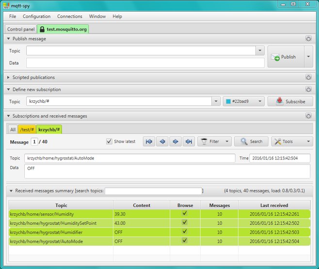

Compete code is saved in GitHub as [OnlineHumidifier-MQTT.ino](OnlineHumidifier-MQTT) - please refer to it in case of issues. Once it is working you are ready to integrate ESP8266 with next exciting software that is called openHAB :smile:


## Next Step

This concludes section how to publish MQTT data from ESP module. In [next section](../A2-openHAB) we would like to use the same routines to send MQTT messages right to openHAB to operate humidifier using user friendly, versatile and well-designed user interface. 
And yes - [openHAB](http://www.openhab.org/) operates on Android and Mac iOS mobile devices as well on Windows and Linux PC.

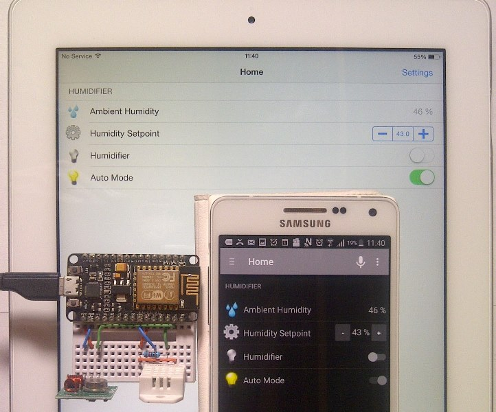 

P.S. BlackBerry will also do the job :smile:

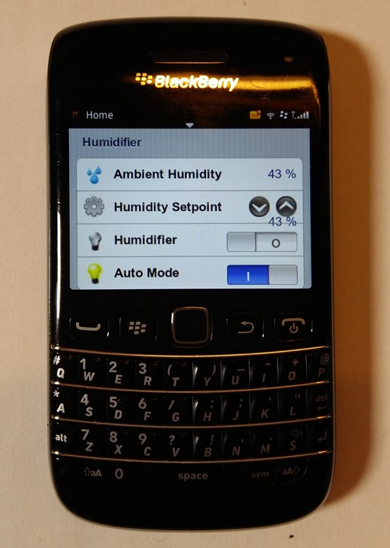
