# openHAB

## Table of Contents
  * [Introduction](#introduction)
  * [Required Components](#required-components)
  * [Where do I Start with openHAB?](#where-do-i-start-with-openhab)
  * [But how to Operate Humidifier with openHAB?](#but-how-to-operate-humidifier-with-openhab)
    * [Items](#items)
    * [Sitemap](#sitemap)
    * [openhab.cfg](#openhabcfg)
  * [What About ESP8266 Application?](#what-about-esp8266-application)
  * [Troubleshooting](#troubleshooting)
  * [Next Steps](#next-steps)
  * [Conclusion](#conclusion)


## Introduction

Having MQTT communication working, we are only one step ahead from being able to operate our humidity control system from openHAB. The key benefit of using openHAB is mature toolbox of software components to build feature reach and user friendly interface. This platform is vendor-neutral as well as hardware/protocol-agnostic, so you can easy use it on Mac, Linux or Windows and interface with almost any device with support by huge library of [bindings and bundles]( http://www.openhab.org/features/supported-technologies.html). With quick look through this library, among dozens of protocols and of home automation devices, you will discover MQTT protocol.  And it happens we have already implemented this protocol for ESP8266 module in [previous section]( ../A1-MQTT) of this guide :smile: 

Let's then use it with openHAB!


## Required Components

* All the component and software used in [previous section](../A1-MQTT)
* Home Automation Server to install openHAB software - the best would be a separate device like NAS or Raspberry PI. In the meantime you can use the same PC you develop sketches ESP8266


## Where do I Start with openHAB?

You need to [download](http://www.openhab.org/getting-started/downloads.html) and [install](http://www.openhab.org/getting-started/index.html) the following components:

1.	Java - this is a platform for openHAB applications to run,
2.	openHAB Runtime - to set up your home automation server,
3.	openHAB Designer - to configure user interface to our humidity control system,
4.	UI application - to run the user interface on your mobile device.

Go to [downloads](http://www.openhab.org/getting-started/downloads.html) section of openHAB site, select packages suitable for your operating system and download them. For installation instructions click [Getting Started](http://www.openhab.org/getting-started/index.html) link on left. 

Using [those instructions](http://www.openhab.org/getting-started/index.html) complete the following steps:

1. **Installing the openHAB runtime**
2. **Picking your bindings** - in this step please find and save *org.openhab.binding.mqtt-N.N.N.jar* into your openhab/addons directory. It is required to make MQTT work!
3. **Installing the openHAB demo** - this one is marked *optional*, but please complete this step. You need to make sure that openHAB demo configuration is working for you. Only then you can start implementing the user interface for humidity control system.
4. **Installing the openHAB designer** - this step is definitely *required* for us (disregard *optional* in the title). Designer provides user friendly configuration file editor with syntax highlighting and error checking.
5. Skip **Configuring the server** and complete remaining steps:
6. **Start the server!**
7. **Go test it!**
8. **Go mobile!**

Make sure that you are able to see and operate the openHAB demo configuration like below on your PC as well as on your mobile device:
  

| 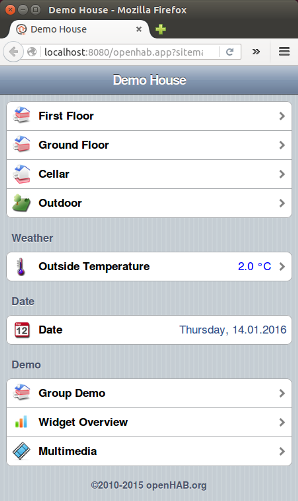 | 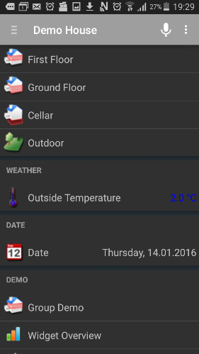 |
| --- | --- |
| openHAB demo on a Ubuntu 14.04 LTS Firefox | openHAB demo on Android phone |

If openHAB demo application is working then proceed to the fun part to build similar screen to operate humidifier!


## But how to Operate Humidifier with openHAB?

If your openHAB installation is running and you verified this using openHAB demo, you are ready to make your own control screen for humidifier.

 Let us develop a screen like below:
 
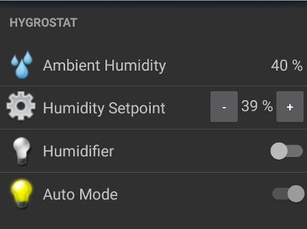

Sounds like a time consuming task? Not really, and let me show you why :smile: 

To make it running, all you need to do, is to prepare two configuration files with [items](#items) and [sitemap](#sitemap); and enable MQTT broker in a [third file](#openhabcfg).

Now it sounds like a manageable task, isn’t it? Then let us do it :+1:


### Items 

The *items* file contains definition how to exchange data with other systems and how to display it. For instance: how to receive ambient humidity value, how to turn humidifier on and off, or how to display received value in specific format (e.g. with one decimal place or none).

Let us start with how to display information. For our project this file looks as follows:
````
Number Humidity			"Ambient Humidity [%.0f %%]"
Number HumiditySetPoint	"Humidity Setpoint [%.0f %%]"
Switch Humidifier 		"Humidifier"					
Switch AutoMode 			"Auto Mode"
````
You should be able to quickly relate above *items* to what you see on the control screen presented [earlier](#but-how-to-operate-humidifier-with-openhab) in this chapter. Each line starts with item type - in our case *Number* or *Switch*. Then comes the item name and text with description - in openHAB terms the *label text*. In two cases the *label text* includes square brackets with formatting how to display item value.

 
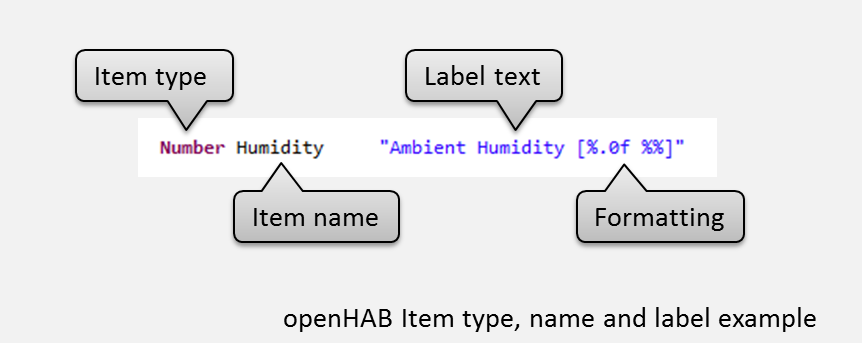

There are couple of other types of items available besides *Number* and *Switch*, for example *String* or *Color*. There are also several [formatting]( http://docs.oracle.com/javase/7/docs/api/java/util/Formatter.html) options. It is moreover possible to show an icon besides an item or group the items. For complete reference please check the section [Explanation of items](https://github.com/openhab/openhab/wiki/Explanation-of-items) in openHAB wiki.

Besides visual presentation, we also need to define how particular item is received and / or how it is send out. In terms of openHAB this is called *binding*.

Below is a sample binding for ambient humidity received using MQTT communication:
```
{mqtt="<[test:krzychb/home/sensor/Humidity:state:default]"}
```
In terms of openHAB the configuration for receiving messages is called *inbound* configuration and marked with < (less than) sign.
 
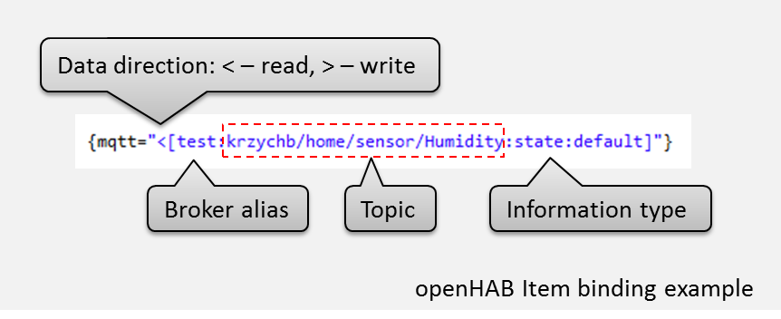


Likely you recognize the topic *krzychb/home/sensor/Humidity* above. It has been provided in the table at the end of [previous section](../A1-MQTT/ readme.md #make-the-topics-meaningful). We have then specified topics for each parameter published by ESP8266. Now we will use exactly the same topics for receiving these parameters by openHAB as below:

| Parameter Description | openHAB Item Name| MQTT Topic - subscribe / inbound |
| --- | --- | --- |
| Ambient humidity | Humidity | krzychb/home/sensor/Humidity |
| Humidity set point | HumiditySetPoint | krzychb/home/hygrostat/HumiditySetPoint |
| Operation status of humidifier | Humidifier | krzychb/home/hygrostat/Humidifier |
| Mode of hygrostat control | AutoMode | krzychb/home/hygrostat/AutoMode |

To switch humidifier on and off, the binding will look as follows:

```
"(…) >[test:krzychb/home/openhab/Humidifier:command:*:default]"
```

As we are sending information out, this is called *outbound* configuration and marked with > (greater than) sign.

Besides switching humidifier on/off we need to read back information if humidifier is on or off. In such case we combine *inbound <* and *outbound >* configuration. 

Complete definition of an item to switch humidifier on/off, which will also read back humidifier on/off state, will look as follows:

```
Switch Humidifier	"Humidifier"	{mqtt="<[test:krzychb/home/hygrostat/Humidifier:state:default], >[test:krzychb/openhab/hygrostat/Humidifier:command:*:default]"}
```

To distinguish outbound and inbound topics for the same variable, let us slightly modify inbound topic above by replacing *home* with *openhab*:

| Parameter Description | openHAB Item Name| MQTT Topic - publish / outbound |
| --- | --- | --- |
| Humidity set point | HumiditySetPoint | krzychb/openhab/hygrostat/HumiditySetPoint |
| Operation status of humidifier | Humidifier | krzychb/openhab/hygrostat/Humidifier |
| Mode of hygrostat control | AutoMode | krzychb/openhab/hygrostat/AutoMode |

Complete *items* file for our humidity control looks as follows:

```
Number Humidity			"Ambient Humidity [%.0f %%]"	<water>		{mqtt="<[test:krzychb/home/sensor/Humidity:state:default]"}
Number HumiditySetPoint	"Humidity Setpoint [%.0f %%]"	<settings>	{mqtt="<[test:krzychb/home/hygrostat/HumiditySetPoint:state:default], >[test:krzychb/openhab/hygrostat/HumiditySetPoint:command:*:default]"}
Switch Humidifier		"Humidifier"								{mqtt="<[test:krzychb/home/hygrostat/Humidifier:state:default], >[test:krzychb/openhab/hygrostat/Humidifier:command:*:default]"}
Switch AutoMode			"Auto Mode"									{mqtt="<[test:krzychb/home/hygrostat/AutoMode:state:default], >[test:krzychb/openhab/hygrostat/AutoMode:command:*:default]"}
```

Create a text file, named it *default.items*, copy to it the configuration above and save in your *openhab/configurations/items* directory. Then open it using openHAB Designer, replace ```krzychb``` with your nickname and save the changes.

In this file you may have noticed text ``` <water> ``` and ``` <settings> ``` that was not described before. Each such text represents an icon that will be displayed besides particular item. For available icons please check contents of * /openhab/webapps/images* directory.  Yes, you can display your own images after adding them to this directory and updating the *items* file :+1:

For other options concerning MQTT binding, please refer to [MQTT binding section](https://github.com/openhab/openhab/wiki/MQTT-Binding) of openHAB wiki.


### Sitemap

Are your still with me? I hope yes. Do not freak out - this one is easier :smile: 

The *sitemap* is the second configuration file we should prepare. It is used to define the structure and contents of your user interface. With just couple of lines of code you can distribute and organize *items* on one or more screens, as well as make adjustment to visualization of *items*. 

In our case the file looks as below:

```
sitemap default label="Home"
{
	Frame label="Hygrostat" 
	{
		Text item=Humidity
		Setpoint item=HumiditySetPoint minValue=20 maxValue=80 step=1
		Switch item=Humidifier
		Switch item=AutoMode
	}
}
```

You should quickly recognize the label “Home” which is the name of the screen displayed at the top. Then you will see a frame labelled “Humidifier”, that groups the four items we have defined previously and saved in [default.items](openhab/defalt.items) file.  Items *Humidity*, *Humidifier* and *AutoMode* are rendered using formatting defined in [default.itmes](openhab/default.itmes). ``` HumiditySetPoint``` is slightly modified by the sitemap. First, it is rendered as *Setpoint*, that means on the screen you will see additional signs - either +/- or ^/v to allow value adjustment. Second, the sitemap provides limits within which the value may be changed (in that case from 20 to 80), and the change step value (here the step is 1, and you can enter other values).

Save this file in your *openhab/configurations/sitemaps* directory using name *default.sitemap* and you are done.

Please note that the text *default* in first line corresponds with file name of *default.sitemap*.  If at some point you change the file name to e.g. *garage.itmes*, you should also change this text to *garage* as well. Otherwise the *Setpoint* may not work correctly.


### openhab.cfg

The last step concerning openHAB is update of *openhab.cfg* configuration file.  This one is even easier. Start openHAB Designer, open this file from *openhab/configuration* directory and locate *MQTT Transport* section. The part that you are concerned with looks as follows:

```
#######################################################################################
#####                       Transport configurations                              #####
#######################################################################################

################################# MQTT Transport ######################################
#
# Define your MQTT broker connections here for use in the MQTT Binding or MQTT
# Persistence bundles. Replace <broker> with a id you choose.
#

# url to the MQTT broker, e.g. tcp://localhost:1883 or ssl://localhost:8883
#mqtt:<broker>.URL=tcp://<host>:1883
```

All the lines above start with *#* that means they are just comments and got ignored by openHAB.

Reading these comments we can figure out three required changes as follows:
1.	Replace <broker> with *test* - as this is the broker alias used in *default.Items* file,
2.	Replace <host> with *test.mosquitto.org*,
3.	Remove the comment sign *#* in front of this line so it becomes the configuration command interpreted by openHAB.

After entering all above changes this line should look as follows:

```
mqtt:test.url=tcp://test.mosquitto.org:1883
```

That is it, and that simple :smile:. 

Save the changes, launch the runtime by executing the script *start.bat* (if you are running Windows) or *start.sh* (if you are on Linux or Mac). After a few seconds (depending on the speed of your computer), you should be ready to check what will be now displayed by openHAB!

Open a web browser and enter the following URL, replacing ``` openHAB_IP_Address ``` with IP address of computer where you have installed openHAB:

```
http://openHAB_IP_Address:8080/openhab.app
```

For instance, if IP of computer with openHAB is 192.168.1.119, then complete URL will be ``` http:// 192.168.1.119:8080/openhab.app ```. Please note that the computer with openHAB and the computer where you open the web browser should be on the same network.

If your mobile device is connected to the same network as well, you can open openHAB UI in dedicated mobile application. Such applications are available for iOS, Android and Pebble - please check “UI applications” in [downloads section](http://www.openhab.org/getting-started/downloads.html) of openHAB web page.

After installing the application and running it, opeHAB server should be discovered automatically. This is assuming your device is on the same network as your openHAB server. In case of issue with automatic discovery, enter the following URL in *Settings > openHAB URL*:

```
http://openHAB_IP_Address:8080
```
 
 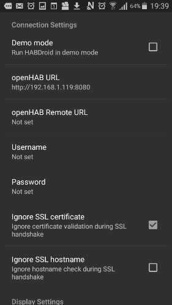

Again substitute ``` openHAB_IP_Address ``` with IP address of computer where you have installed openHAB server.

If your ESP is connected to Wi-Fi network and running *OnlineHumidifier-MQTT.ino* created in [previous section](../A1-MQTT/OnlineHumidifier-MQTT), you should see the following in mobile application as well as in web browser:

| 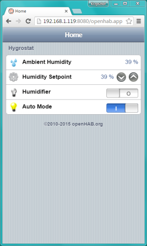 | 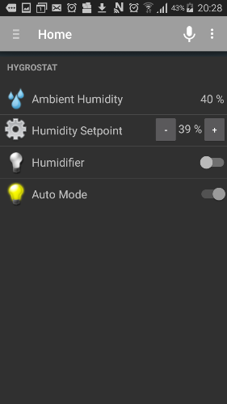 |
| --- | --- |
| Hygrostat on Windows 7 Google Chrome | Hygrostat on Android phone |

If you operate controls on the screen by changing Humidity Setpoint and toggling the switches, you should see on mqtt-spy respective messages passed over MQTT:

 
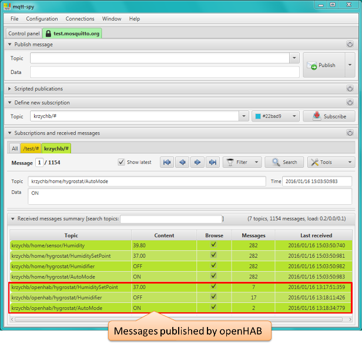


## What About ESP8266 Application?

Sure, now once openHAB is listening to ESP module, it is time to close the loop and make ESP module listening to openHAB. 

Exactly as we have subscribed mqtt-spy to receiving messages published by ESP or openHAB, now we need to subscribe ESP module to receiving messages published by openHAB.

Start off by opening sketch [OnlineHumidifier-MQTT.ino](OnlineHumidifier-MQTT)  and saving it as OnlineHumidifier-openHAB.ino.

To subscribe you need to enter the following single line of code:

``` cpp
    MQTTclient.subscribe("krzychb/openhab/hygrostat/#");
```
Execute this code each time you are connecting (or reconnecting) to the MQTT broker. As result you will subscribe ESP8266 to receiving any MQTT message that begins with *krzychb/home/openhab/*.

Once a message to such subject is received, it will trigger the callback function *MQTTcallback*. Inside this callback function, we need to look up for specific topic and act accordingly:

``` cpp
void MQTTcallback(const MQTT::Publish& pub)
{
  if (pub.topic() == "krzychb/openhab/hygrostat/HumiditySetPoint")
  {
    humiditySetPoint = pub.payload_string().toFloat();
  }

  if (pub.topic() == "krzychb/openhab/hygrostat/Humidifier")
  {
    humidifier = (pub.payload_string() == "ON") ? HIGH : LOW;
    actionTransmitter.sendSignal(1, rcDevice, humidifier);
  }

  if (pub.topic() == "krzychb/openhab/hygrostat/AutoMode")
  {
    autoMode = (pub.payload_string() == "ON") ? true : false;
  }
}
```
More specifically, this code is checking ``` pub.topic()  ``` that provides the topic to which the message arrived.  Depending on the code, specific action is performed using the value provided by ``` pub.payload_string()  ```.  For example, if the topic is ``` krzychb/openhab/hygrostat/Humidifier ```, and the value provided by ``` pub.payload_string()  ``` is ``` ON ```, ESP should  switch the humidifier on.

OK, there are two more things we need to do.

First, we need to register the callback function *MQTTcallback* discussed above. To do so, place the following code in ``` setup() ```:

``` cpp
  MQTTclient.set_callback(MQTTcallback);
```  

Second, we need to periodically check if MQTT connection is alive and call ``` MQTTclient.loop() ``` to process incoming messages. We will enclose these two actions in a single function ``` MQTTkeepAlive() ``` as follows:

``` cpp
void MQTTkeepAlive(void)
{
  if (!MQTTclient.connected())
  {
    MQTTclient.connect(MQTTclientName);
  }
  else
  {
    MQTTclient.loop();
  }
}
```

The complete ``` loop() ``` including call to the above function is shown below.

```cpp
void loop(void)
{
  ArduinoOTA.handle();
  server.handleClient();
  MQTTkeepAlive();

  if (millis() % 45000 == 0)
  {
    measureHumidity();
    if (autoMode == true)
    {
      executeHumidityControl();
    }
    sendDataToEmoncms();
    MQTTpublishData();
  }
}
```

The complete code is available in this GitHub repository as [OnlineHumidifier-openHAB.ino](OnlineHumidifier-openHAB). It contains some extra diagnostic messages to make debugging easier. Please review it if you follow all the changes made. Then replace ``` krzychb ``` in all topics with your nickname, compile and upload it to your ESP module. Do not forget about updating SSID and password to your Wi-Fi network. 

If nothing is missed, then you will be able to change humidity set point, switch humidifier on/off and toggle the hygrostat’s auto mode using openHAB.


## Troubleshooting

For each particular piece of software and hardware discussed in this guide, use specific troubleshooting tools discussed before. Below is summary for troubleshooting of MQTT communication and ESP8266 application. 

Use mqtt-spy as a simple and effective way to check what MQTT messages are sent between openHAB and ESP module, if they are sent to desired topic, and if they contain expected value. If required, publish test messages [directly from mqtt-spy](../A1-MQTT#send-mqtt-message-manually).

To see what ESP application is doing, use [external serial terminal](https://github.com/esp8266/Arduino/blob/master/doc/ota_updates/ota_updates.md#troubleshooting). The [OnlineHumidifier-openHAB.ino](OnlineHumidifier-openHAB) sketch includes some extra diagnostics messages. They will help to follow what module is currently doing and what MQTT messages send by openHAB are captured by ``` MQTTcallback ``` function. 

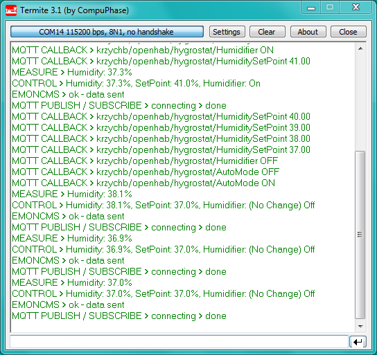

I recommend checking the log on serial terminal to assess time required to send data to Emoncms.org and publish MQTT messages. Then verify how this affects application functionality. Depending on your network it may take couple of seconds to send the data out. When this happens, as the s/w is operating now, the module is not processing incoming MQTT messages. Please check it by trying to change humidity set point from openHAB when you see module transmitting data to Emonsms.org. This will not work and looks like good opportunity to make improvements in application so processing of commands from openHAB is not blocked by other operations on ESP module.

For such testing you need to get familiar with another useful tool - the openHAB’s OSGI-Console. This console is my primary tool for troubleshooting as it provides detailed log of each command sent out, each value update or command received. In case of traceable errors you will see specific error messages as well. The typical log looks like below:

 
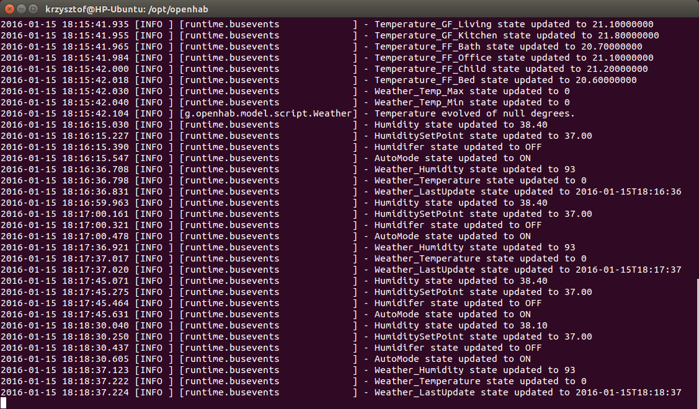

If your demo configuration is running, this log gets crowded with messages that you may not be interested in. If number of messages becomes the issue to catch information on update of specific item, just remove demo files from *openhab/configuration* folder. The log of openHAB processing only hygrostat application looks much clear and should be easier to analyze:

 

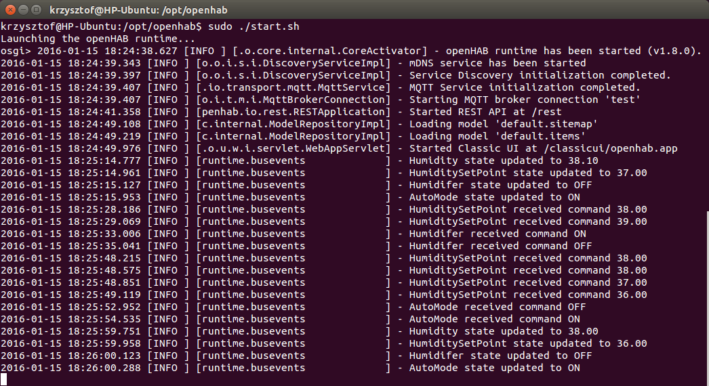


## Next Steps

If you like this application and planning to use it, think how to make it more reliable and permanent. Below are some ideas:

1.	Install openHAB on a standalone platform like NAS, Raspberry PI, BeagleBone, Odroid or another similar computer. Then you can have openHAB running continuously and independently from your PC.
2.	Install MQTT broker on the same platform as openHAB to get independent from public broker. Each MQTT messages now travels all the way to test.mosquitto.org and back! 
3.	Solder components on a proto board and put them in an enclosure. This is to protect your hygrostat from malfunction because of bad contacts, disconnecting some component or damage.


## Conclusion

I hope you agree that building easy to operate and nicely looking user interface with openHAB is easy. You get the same functionality, look and feel of interface on Windows, Linux and Mac computer as well as on iOS and Android mobile devices. I really like such flexibility. This way, after configuring openHAB only once, everybody can use it on their favorite platform. 

The good news is that the Online Humidifier example provided this section shows only a fraction of functionality available with openHAB. Go ahead, explore it together with ESP8266 or other microcontrollers and have fun!

