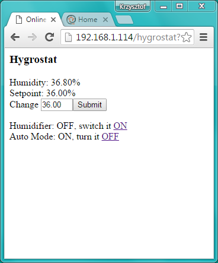
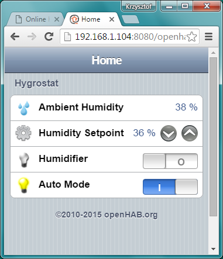
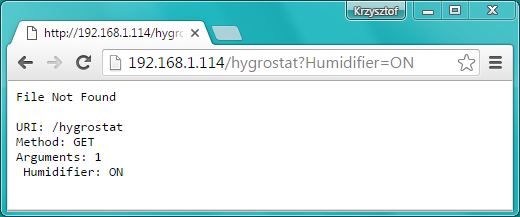
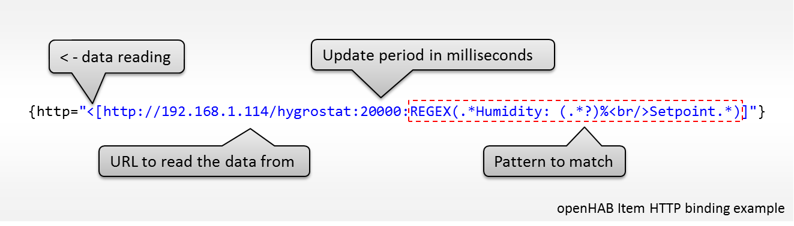
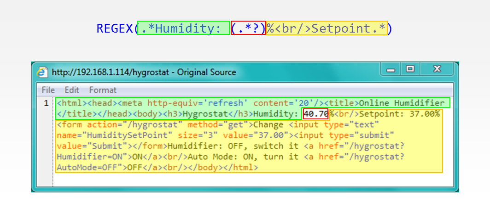
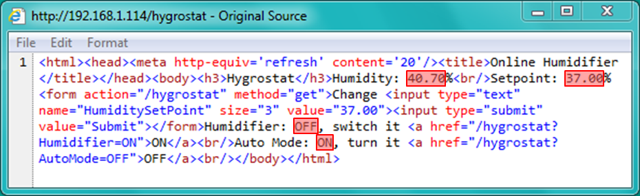

# HTTP

An openHAB binding alternative to MQTT


## Table of Contents

* [Introduction](#introduction)
* [Ground Work](#ground-work)
* [Issuing Commands](#issuing-commands)
* [Web Page Update](#web-page-update)
* [Sketch Update and Test](#sketch-update-and-test)
* [Only Items to Update](#only-items-to-update)
  * [Issuing Commands](#issuing-commands)
  * [Reading the Information Back](#reading-the-information-back)
* [Check it in Action](#check-it-in-action)
* [Conclusion](#conclusion)


## Introduction

OpenHAB is offering several ways of interfacing with IOT world. Just check the list of available [Bindings and Bundles](http://www.openhab.org/features/supported-technologies.html). Before switching to MQTT I have been using HTTP binding. I was just reluctant to go to MQTT because it required installation of additional s/w and learning a new protocol. In this chapter I would like to present how to use it instead of MQTT – it is possible that you may still feel like me before :smile:
HTTP binding is simpler to implement and offers direct connection to IOT devices as opposed to MQTT that brings a broker in between. On the other hand MQTT provides lightweight protocol and more convenient way to exchange information between any of connected devices. 

Reading this chapter you will have opportunity to check it out using exactly the same h/w and s/w as before. It should be quick and easy job as we will be building on experience gathered going through [previous chapters](../readme.md#step-by-step-tutorial) of this repository. I think that HTTP binding is worth exploring – you will assess and judge by yourself the cons and pros against MQTT binding.


## Ground Work

Using HTTP binding to send commands and retrieving information is like browsing a web page. You issue commands by clicking URLs and retrieving information by looking on contents of displayed web page. To make implementation of this binding possible, we should update the web page served by ESP module. This is so it provides URLs to issue all commands we need, like changing the set point or turning the Auto Mode on and off. It should also display all the information that we are displaying on openHAB. 

Essentially all the commands and information that we would like to see on openHAB, should be available on this web page. We will then use HTTP biding to link this commands and information with nice, user friendly and versatile openHAB interface. Please see below the web page we need, and for comparison the corresponding openHAB UI we have developed previously.

|  |  |
| --- | --- |
| ESP web page we need | Exisitng openHAB UI |


## Issuing Commands

HTTP binding is using URLs to issue commands. We got familiar with such commands in section [Control](../7-Control), chapter [Operate the Socket from Web Browser](../7-Control#operate-the-socket-from-web-browser). For example, to operate humidifier on and off, we have been using URLs as follows:

* ``` http://192.168.1.114/humidifier/1 ``` - to turn humidifier on
* ``` http://192.168.1.114/humidifier/0 ``` - to turn it off

We will use similar concept and slightly adjust it to provide generic way to handle the commands as below:

| # | Command | URL |
| --- | --- | --- |
| 1 | Turn humidifier on  | ``` http://192.168.1.114/hygrostat?Humidifier=ON ``` |
| 2 | Turn humidifier off | ``` http:// 192.168.1.114/hygrostat?Humidifier=OFF ``` |
| 3 | Turn auto mode on  | ``` http:// 192.168.1.114/hygrostat?AutoMode=ON ``` |
| 4 | Turn auto mode off | ``` http:// 192.168.1.114/hygrostat?AutoMode=OFF ``` |
| 5 | Change humidity set point to e.g. 38% | ``` http:// 192.168.1.114/hygrostat?HumiditySetPoint=38 ``` |


It turns out that sketch we have developed already has built in functionality to process such URLs. 

Let's get started. Open recently developed [OnlineHumidifier-openHAB.ino](../A2-openHAB/OnlineHumidifier-openHAB) and save it as *OnlineHumidifier-HTTP.ino*. Compile and upload it to ESP module. 

Once module joins network, open web browser and enter ``` http://192.168.1.114/hygrostat?Humidifier=ON ``` (replace ``` 192.168.1.114 ``` with IP of your ESP). 
You should see result as follows:



With some little searching in the *OnlineHumidifier-HTTP.ino* code, you should be able to find the function ``` void handleNotFound(void) ``` that has captured URL we have entered and split it into URI ``` /hygrostat ``` and argument after ``` ? ```. Then the argument is further split into name ``` Humidifier ```and value ``` ON ```.  See details of this function below:

```cpp
void handleNotFound(void)
{
  String message = "File Not Found\n\n";
  message += "URI: ";
  message += server.uri();
  message += "\nMethod: ";
  message += (server.method() == HTTP_GET) ? "GET" : "POST";
  message += "\nArguments: ";
  message += server.args();
  message += "\n";
  for (uint8_t i = 0; i < server.args(); i++) {
    message += " " + server.argName(i) + ": " + server.arg(i) + "\n";
  }
  server.send(404, "text/plain", message);
} 
```

This function is responsible for capturing any URL not processed otherwise by functions ``` server.on ``` or ``` handleRoot ```.

Go ahead and enter ``` http:// 192.168.1.114/hygrostat?HumiditySetPoint=38 ``` (again replace ``` 192.168.1.114 ``` with IP of your ESP :smile:). This one is captured as well with the result as follows:


Using function ``` server.on("/hygrostat", []()  ``` that captures specific URI ``` /hygrostat ``` and basing on the above code, we are able to retrieve the name and value pairs for each command. Then it is the matter of using retrieved information to operate our hygrostat. 

The function processing all five commands we need is provided below:

```cpp
server.on("/hygrostat", []() {
  for (uint8_t i = 0; i < server.args(); i++)
  {
    if (server.argName(i) == "Humidifier")
    {
      humidifier = (server.arg(i) == "ON") ? HIGH : LOW;
      actionTransmitter.sendSignal(1, rcDevice, humidifier);
    }
    else if (server.argName(i) == "AutoMode")
    {
      autoMode = (server.arg(i) == "ON") ? true : false;
    }
    else if (server.argName(i) == "HumiditySetPoint")
    {
      humiditySetPoint = server.arg(i).toFloat();
    }
    else
    {
      Serial.println("unknown argument! ");
    }
    Serial.print(server.argName(i));
    Serial.print(": ");
    Serial.print(server.arg(i));
    Serial.printn();
  }
});
```

This function will also print out any argument name, that is not recognized (i.e. other than *Humidifier*, *AutoMode* and *HumiditySetPoint*).


## Web Page Update

Now we should update function ``` showControlScreen() ``` that is serving the web page to display all five URLs / commands discussed above.

```cpp
void showControlScreen(void)
{
  String message;
  message += "<html>";
  message += "<head><meta http-equiv='refresh' content='20'/><title>Online Humidifier</title></head>";
  message += "<body>";
  message += "<h3>Hygrostat</h3>";
  message += "Humidity: " + (String) humidity + "%<br/>";
  message += "Setpoint: " + (String) humiditySetPoint + "%";
  message += "<form action=\"/hygrostat\" method=\"get\">";
  message += "Change <input type=\"text\" name=\"HumiditySetPoint\" size=\"3\" value=\"" + (String) humiditySetPoint + "\"><input type=\"submit\" value=\"Submit\">";
  message += "</form>";
  message += "Humidifier: ";
  if (humidifier == true)
  {
    message += "ON, switch it <a href=\"/hygrostat?Humidifier=OFF\">OFF</a><br/>";
  }
  else
  {
    message += "OFF, switch it <a href=\"/hygrostat?Humidifier=ON\">ON</a><br/>";
  }
  message += "Auto Mode: ";
  if (autoMode == true)
  {
    message += "ON, turn it <a href=\"/hygrostat?AutoMode=OFF\">OFF</a><br/>";
  }
  else
  {
    message += "OFF, turn it <a href=\"/hygrostat?AutoMode=ON\">ON</a><br/>";
  }
  message += "</body>";
  message += "</html>";
  server.send(200, "text/html", message);
}
```

The only new concept in this function, comparing to its original version, is HTML **form** tag. We need it to provide entry field for numeric *Value* that is submitted by ``` http:// 192.168.1.114/hygrostat?HumiditySetPoint=Value ``` request. For more details regarding the **form** tag please check [w3schools.com](http://www.w3schools.com/tags/tag_form.asp).


## Sketch Upload and Test

That completes the key changes to the sketch. Now what you need to do, is removing all the MQTT code that is not required anymore. You can also remove three ``` server.on("/humidifier/… ``` functions. Once done, upload and test the code to check if you can operate all hygrostat functions from the web page.  Open [external serial terminal](https://github.com/esp8266/Arduino/blob/master/doc/ota_updates/ota_updates.md#troubleshooting) to see diagnostic log when checking each function. Final application contains some extra debugging messages printed out over a serial port to help with diagnostics. It is available in this repository saved under [OnlineHumidifier-HTTP.ino](../A3-HTTP/OnlineHumidifier-HTTP). 

Now you can move to configuration of openHAB that is rather straightforward.


## Only Items to Update

We need to update only [default.items](openhab) file and there are two types of updates to be made. First one is for issuing commands and second is for reading the information back from module.

HTTP item binding is similar to MQTT binding [discussed previously](../A2-openHAB/readme.md#items). The only practical difference is that instead of each MQTT topic we are using an URL. All other information for each existing *item* besides inboud and outbund binding stays the same. The two chapters below provide more details on that.


### Issuing Commands

What we need to do is replacement of MQTT outbound binding for with HTTP binding containing URLs that we have prepared [before](#issuing-commands). 

The HTTP binding to switch humidifier on and off looks as follows:

```
>[ON:GET:http://192.168.1.114/hygrostat?Humidifier=ON]
>[OFF:GET:http://192.168.1.114/hygrostat?Humidifier=OFF]
```
As the only difference between both commands is text *ON* and *OFF*, we can compress it to a single statement as below:

```
>[*:GET:http://192.168.1.114/hygrostat?Humidifier=%2$s]
```

The same applies to commands to change the AutoMode and HumiditySetPoint:

```
>[*:GET:http://192.168.1.114/hygrostat?AutoMode=%2$s]
>[*:GET:http://192.168.1.114/hygrostat?HumiditySetPoint=%2$s]
```

Looks simple?  I hope so :smile:

Just remember to replace ``` 192.168.1.114 ``` with IP of your ESP module. And here we are getting to one of potential issues with HTTP binding. If we are using IP addresses instead of domain names, we need to change them in opeHAB configuration each time the IP of respective module changes. With MQTT binding you enter the topic once and then do not need to worry about changes of IP addresses of other devices you communicate with. This task is on shoulders of MQTT broker that relays messages to respective devices basing on topics they subrecibed to.


### Reading the Information Back

The second configuration update is for reading information from the module back to the openHAB. 

Respective command to retrieve ambient humidity will look as follows:



The first part of this string up to ``` 2000 ``` looks familiar. It is just the URL to the web page served by our ESP module. The rest of the string may look intimidating, but only if you are not familiar with [regular expressions](http://regexone.com/) :smile: 

The expression ``` REGEX() ``` is responsible for searching the webpage returned by ``` http://192.168.1.114/hygrostat ``` to match a specific pattern of characters in order to locate and [extract](http://regexone.com/lesson/capturing_groups) humidity value. To understand how it works, enter ``` http://192.168.1.114/hygrostat ``` address in web browser to open hygrostat screen. Then right click on this screen and select *View source* (or *View page source*, depending on web browser you use). You will see HTML source that would be searched by ``` REGEX() ``` code.  Please see the picture below that explains particular parts of pattern being matched:



The text searched like *Humidity* or *Setpoint* looks obvious. The expression ``` .*  ``` will match zero or more occurrences of any character (letter, digit, whitespace, everything).

Below is complete set or regular expressions we need:

| Information to Read | Regular Expression |
| --- | --- |
| Ambient Humidity | ``` REGEX(.*Humidity: (.*?)%<br/>Setpoint.*) ``` |
| Humidity Setpoint | ``` REGEX(.*Setpoint: (.*?)%<form.*) ``` |
| Status of Humidifer | ``` REGEX(.*Humidifier: (.*?), switch it .*) ``` |
| Status of Auto Mode | ``` REGEX(.*Auto Mode: (.*?), turn it .*) ``` |

Now review the same HTML code on picture below against regular expression in table above. See where the information we are looking for is located, and how regular expression is matching the text nearby to extract what we need.



I believe you got an idea what regular expressions are about. To go a little more into details I recommend checking [this nice interactive tutorial](http://regexone.com/). You will be able to enter your own regular expressions and instantly check how they work. Do not wait, check it out – learning regular expression using this tutorial is fun!

That is all you need to get HTTP binding to work for you. Please see below complete [default.items](openhab/default.items) configuration file. 

```
Number Humidity			"Ambient Humidity [%.0f %%]"	<water>		{http="<[http://192.168.1.114/hygrostat:20000:REGEX(.*Humidity: (.*?)%<br/>Setpoint.*)]"}
Number HumiditySetPoint	"Humidity Setpoint [%.0f %%]"	<settings>	{http=">[*:GET:http://192.168.1.114/hygrostat?HumiditySetPoint=%2$s] <[http://192.168.1.114/hygrostat:20000:REGEX(.*Setpoint: (.*?)%<form.*)]"}
Switch Humidifier		"Humidifier"								{http=">[*:GET:http://192.168.1.114/hygrostat?Humidifier=%2$s] <[http://192.168.1.114/hygrostat:20000:REGEX(.*Humidifier: (.*?), switch it.*)]"}
Switch AutoMode			"Auto Mode"									{http=">[*:GET:http://192.168.1.114/hygrostat?AutoMode=%2$s] <[http://192.168.1.114/hygrostat:20000:REGEX(.*Auto Mode: (.*?), turn it.*)]"}
```

Again remember to replace ``` 192.168.1.114 ``` with the IP address of your module :smile:. Then upload it to openHAB *configurations/items* directory. The other configuration file, [default.sitemap](openhab/default.sitemap) is exactly the same as we have used [previously](../A2-openHAB#sitemap) setting up MQTT binding.


## Check it in Action

After uploading openHAB configuration, you are finally ready to check it in action with [OnlineHumidifier-HTTP.ino](../A3-HTTP/OnlineHumidifier-HTTP) sketch. Go ahead, open the web page served by ESP module as well as openHAB user interface side by side like shown in chapter [Ground Work](#ground-work). Then operate hygrostat from openHAB. You should see all the changes reflected on ESP web page and vice versa. In case of issues do the troubleshooting using [external serial terminal](https://github.com/esp8266/Arduino/blob/master/doc/ota_updates/ota_updates.md#troubleshooting)  together with openHAB’s OSGI-Console as discussed in [previous section](../A2-openHAB#troubleshooting).


## Conclusion

You had a chance to compare functionality and ease of use of HTTP and MQTT bindings to decide which one better suit your needs.

I believe HTTP binding is a good solution for small IOT networks that consist of couple of devices. For bigger networks it is worth to invest extra effort to setting up MQTT broker and developing of structure of topics to quickly get to specific data. In return, network maintenance and expansion with new devices or type of transmitted information should be easier. Other cons and pros of MQTT and HTTP binding depend on how the data is exchanged between devices. Whether we prefer to ask each time for specific data when needed. Or rather we are just collecting data from numerous devices and prefer to subscribe to specific topics and wait until update arrives.

My favorite chapter when preparing this section was [Reading the Information Back](#reading-the-information-back). This is because it covers regular expressions, which for me represent very efficient and elegant way of processing and extracting text information. I like working with programming languages that have them implemented, like [Perl](https://www.perl.org/).

Explore new tools, make them work for you and have fun!

