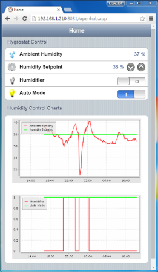
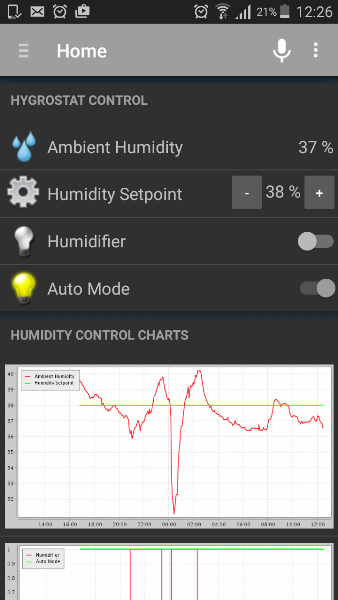
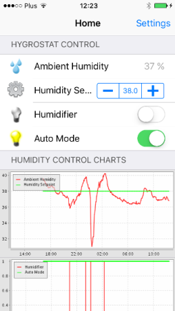

# Persistence


## Table of Contents
* [Introduction](#introduction)
* [Required Components](#required-components)
* [The rrd4j Persistence](#the-rrd4j-persistence)
* [Configure rrd4j](#configure-rrd4j)
  * [Configure Items](#configure-items)
  * [Configure Charts](#configure-charts)
  * [Install rrd4j Package](#install-rrd4j-package)
* [What About the Sketch? ](#what-about-the-sketch)
* [Conclusion](#conclusion)


## Introduction

["There is no cloud. It's just someone else's computer."](https://www.stickermule.com/marketplace/3442-there-is-no-cloud)

Are you concerned that your sensor data are stored on someone else's computer?  If this is the case then save them on your own PC!  It turns out that it is very easy and you do not need any additional new s/w and h/w than used before. All you need to do is to configure functionally already existing in [openHAB](http://www.openhab.org/). 

In this section I would like to show how to store sensor data using *Persistence* functionality of [openHAB](http://www.openhab.org/) instead of sending them to [Emoncms](https://emoncms.org/). 


## Required Components

* All the components and software used in [section A3-HTTP](../A3-HTTP)


## The rrd4j Persistence

[Persistence](https://github.com/openhab/openhab/wiki/Persistence) is a term used in openHAB for storing item states over time. There several persistence options offered and [rrd4j](https://github.com/rrd4j/rrd4j) (round-robin database) is one of them.  In fact it is default openHAB's persistence. Unlike other databases rrd4j does not grow in size - it has a fixed allocated size. The name *rrd4j* itself may not sound familiar but [rrd4j persistence](https://github.com/openhab/openhab/wiki/rrd4j-Persistence) is well documented on openHAB wiki. Therefore you can refer to wiki to go more into functionality details as this section presents only the bare minimum to get it running.


## Configure rrd4j

There are three things you need to do to get rrd4j running:
1. Configure items for saving in rrd4j database 
2. Configure charts to display items
3. Install rrd4j binding package 

More details are provided below


### Configure Items

There are just four items processed by openHAB (``` Humidity ```, ``` HumiditySetPoint ```, ``` Humidifier ```, ``` AutoMode ```) and let's configure all of them for saving in rrd4j database.  To do so we need to create a configuration file that specifies names of each item to save. Besides that we need to define *Strategies* how often to save each particular item. 

Respective configuration file has name *rrd4j.persist* and looks as follows:

```
Strategies
{
	everyMinute : "0 * * * * ?"
}

Items
{
	Humidity, HumiditySetPoint, Humidifier, AutoMode : strategy = everyChange, everyMinute, restoreOnStartup
}
```
In the above example, for sake of simplicity, we are defining just one *Strategy* named ``` everyMinute ```. The following code ``` "0 * * * * ?" ``` is so called [cron expression](https://en.wikipedia.org/wiki/Cron)  to specify at which exact second, minute, hour, etc. the data should be saved. In our case the sensor data will be saved at 0 seconds of each and every minute.

Then under *Items* comes the list of all items to be saved together with ``` strategy = everyChange, everyMinute, restoreOnStartup ```. This essentially means that each item should be saved on each change as well as every minute. The last strategy means that on openHAB startup, if the value is not defined, the last saved value will be restored from database.

The two strategies ``` everyChange ``` and ``` restoreOnStartup ``` are already statically defined and not listed separately like ``` everyMinute : "0 * * * * ?" ```.


### Configure Charts

We are going to configure two charts. The first will contain ``` Humidity ``` and ``` HumiditySetPoint ``` values. The second will show if humidifier is on or off, as well if control is in auto or manual mode (items ``` Humidifier ``` and ``` AutoMode ```). To do so we first need to define two groups and then specify items belonging to each group. 

The groups will be named ``` HumidityChart ``` and  ``` ControlChart  ``` and are defined in *Items* configuration file as below:

```
Group HumidityChart 	(All)
Group ControlChart 		(All)
```
Then besides particular item we need to add a group name like ``` (HumidityChart) ```. This specifies the group where item belongs to:

```
Number Humidity			"Ambient Humidity [%.0f %%]"	<water>		(HumidityChart)	{http="<[http://192.168.1.114/hygrostat:20000:REGEX(.*?Humidity: (.*?)%<br/>Setpoint.*)]"}
Number HumiditySetPoint	"Humidity Setpoint [%.0f %%]"	<settings>	(HumidityChart)	{http=">[*:GET:http://192.168.1.114/hygrostat?HumiditySetPoint=%2$s] <[http://192.168.1.114/hygrostat:20000:REGEX(.*?Setpoint: (.*?)%<form.*)]"}
Switch Humidifier		"Humidifier"								(ControlChart)	{http=">[*:GET:http://192.168.1.114/hygrostat?Humidifier=%2$s] <[http://192.168.1.114/hygrostat:20000:REGEX(.*?Humidifier: (.*?), switch .*)]"}
Switch AutoMode			"Auto Mode"									(ControlChart)	{http=">[*:GET:http://192.168.1.114/hygrostat?AutoMode=%2$s] <[http://192.168.1.114/hygrostat:20000:REGEX(.*?Auto Mode: (.*?), turn .*)]"}
```

Finally we should specify where to show the charts, what will be the time scale period and how often to refresh each chart. This information is placed in the *sitemap* file and will look as follows:

```
Frame label="Humidity Control Charts" 
{
	Chart item=HumidityChart period=d refresh=6000
	Chart item=ControlChart period=d refresh=6000
}	
```

Statement ``` period=d ``` means that chart will show one day worth of data. Please refer to [openhab](openhab) folder for each of the three configuration files discussed above - [rrd4j.persist](openhab/rrd4j.persist), [default.items](openhab/default.items) and [default.sitemap](openhab/default.sitemap). You need to save each particular file to respective *persistence*, *items* and *sitemaps* folder.


### Install rrd4j Package

The last configuration steep is installation of org.openhab.persistence.rrd4j-N.N.N.jar package (where N.N.N is the version number of your openHAB installation). This package should be placed in *addons* folder like [MQTT](../A2-openHAB) or [HTTP](../A3-HTTP) binding packages discussed previously. This step is done only once to enable rrd4j persistence for your openHAB installation.


## What About the Sketch?

To check rrd4j persistence you can use ESP loaded with exactly the same sketch as prepared in [previous section](../A3-HTTP).  Go ahead, open openHAB in web browser. If configuration described above was done correctly you should see a screen like on samples below.

|  |  |  |
| --- | --- | --- |
| openHAB with charts on a PC | openHAB with charts on an Android phone | openHAB with charts on an iPhone |

But the idea presented in [introduction](#introduction) was to replace Emoncms :smile: Therefore please open [OnlineHumidifier-HTTP.ino](../A3-HTTP/OnlineHumidifier-HTTP) sketch and delete all Emoncms related declarations and procedures. This should be quite easy task as declarations are divided into functional sections and all Emoncms procedures are in a single file. 

Final sketch is saved as [OnlineHumidifier-Persistence.ino](OnlineHumidifier-Persistence).


## Conclusion

The options to do the same or a very similar thing with available free software are enormous. Previous sections provided options to show data using a crude interface made in bare html in a web browser and in a nice interface of openHAB. Other sections provided options to integrate openHAB and ESP using MQTT or HTTP binding. This section presents example of providing data storage and visualization directly on [openHAB](http://www.openhab.org/) home automation platform instead in [Emoncms](https://emoncms.org/) cloud. 

Select what you believe is better, more reliable and simpler for you. Have fun learning how to make good choices and implementing it!
