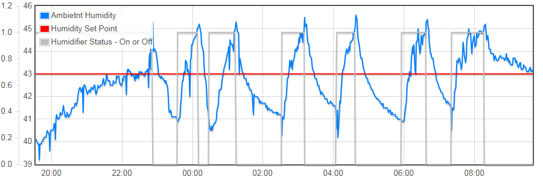
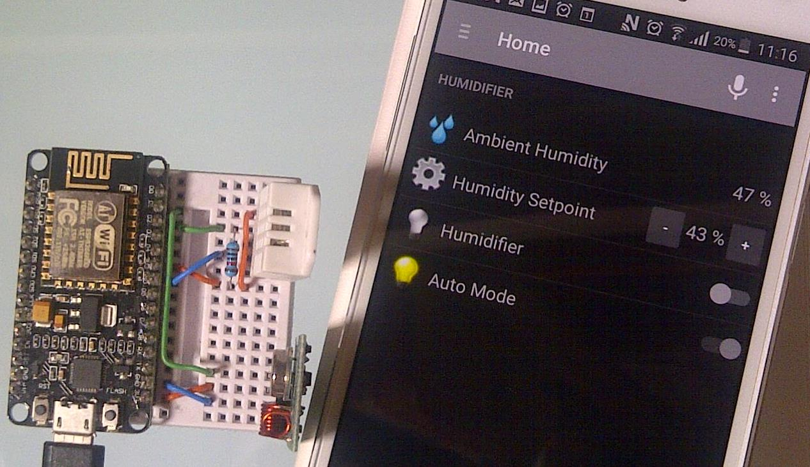

# Online Humidifier

This repository provides step by step guide how to automatically control humidity in your home.

It is fun to build, consists of easy to get components and costs just $50.

## What You Need

There are only couple of cheap and easy to get components to make your project running

* Humidifier - $25
* ESP8266 board - $8
* Humidity sensor - $5
* RC Socket - $5
* RF Transmitter - $1 
* Breadboard - $5
* Cables - $1
* PC - $0 - you likely have one already as you are reading this web page :smile:

For more details please refer to [Components](2-Components) section.

## Step by Step Tutorial

Depending on your experience, to make implementation easier, this project is broken down into the following steps:

* [**Introduction**](1-Introduction) - check it to learn more about this project and how we are going to implements it.

* [**Components**](2-Components) - describes in detail components you need and what you should look at when buying them.

* [**Setup**](3-Setup) - how to configure Arduino IDE for ESP8266 and compile first sketch

* [**Measure**](4-Measure) - details how to measure humidity with ESP8266 and DHT22 sensor.

* [**Show**](5-Show) - go on line and show humidity measurements in web browser.

* [**Chart**](6-Chart) - how to push data to the cloud and display nice charts with measurements.

* [**Control**](7-Control) - switch on and off wireless RF 433MHz socket using ESP8266 and RF transmitter.

* [**Automate**](8-Automate) - with all preparation done in prevoius steps now we are ready to put our humidity control system together and switch it into auto mode!

* [**Maintain**](9-Maintain) - how to make code uploads easier and quicker with OTA (Over The Air) updates.

#### Appendixes

* [**MQTT**](A1-MQTT) - communicate with other devices using MQTT protocol.

* [**openHAB**](A2-openHAB) - control humidifier from your mobile device using [openHAB](http://www.openhab.org/). 

* [**HTTP**](A3-HTTP) - interface ESP8266 and openHAB using HTTP binding. Is it a viable alternative to MQTT binding?

* [**Persistence**](A4-Persistence) - save sensor values on your local PC instead in the cloud using *persistence* functionality provided by openHAB.

**Note:** If you do not have much experience with Arduino IDE programming and ESP8266, please don't skip ahead in sections of this repository! New concepts are introduced step by step and you may miss something that will be important later. As result you may get stuck trying to make the sketch or other applications work.

## Contribute

Feel free to contribute to the project in any way you like! 

If you find any issues with code or descriptions please report them using *Issues* tab above. 

If you like to discuss it please use [this thread](http://www.esp8266.com/viewtopic.php?p=37446#p37446) on ESP8266 Community Forum. 

## Author

krzychb

## Donations

Invite me to freshly squeezed orange juice.

## Credits

Software for this project has been prepared thanks to great work of the following teams and individuals:
* Arduino team that develops and maintains versatile [Arduino IDE](https://www.arduino.cc/)
* esp8266/Arduino team lead by [Ivan Grokhotkov](https://twitter.com/i_grr) that brought to us great [ESP8266 core for Arduino](https://github.com/esp8266/Arduino)
* [adafruit](https://www.adafruit.com/) providing [DHT sensor library](https://github.com/adafruit/DHT-sensor-library) that is only one of numerous examples of open software adafruit contributed to community
* [Randy Simons](http://randysimons.nl/88,over-mij/) who prepared [433MHz libraries for Arduino](http://randysimons.nl/26-433mhz-libraries-for-arduino)
* [Friends-of-Fritzing](http://friends.fritzing.org/) foundation - developer of widely used and really nice and friendly [Fritzing](http://fritzing.org/home/) 
* [Kamil Baczkowicz]( https://github.com/kamilfb) - the author of versatile and really user friendly [mqtt-spy]( http://kamilfb.github.io/mqtt-spy/), an application that provides tremendous help when testing MQTT communication and debugging MQTT messages
* [Imroy](https://github.com/Imroy) - developer of [PubSubClient](https://github.com/Imroy/pubsubclient), a MQTT library fork of https://github.com/knolleary/pubsubclient

## License

[GNU LESSER GENERAL PUBLIC LICENSE - Version 2.1, February 1999](LICENSE)

